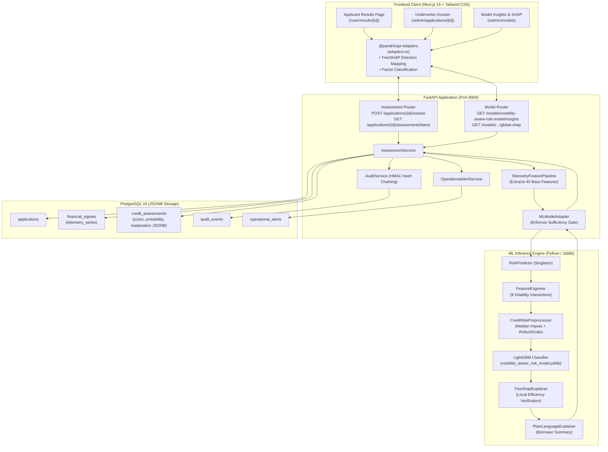

# PARAKH — Machine Learning Models & System Integration Architecture Report

**Platform:** PARAKH Alternative Credit Risk Assessment Platform  
**Target Domain:** Alternative Underwriting for Gig Economy Workers, Freelancers, and Informal Commerce  
**Production Model Identifier:** `volatility-aware-risk-model` (v1.0.0)  
**Document Classification:** Production Architectural Specification & Comprehensive ML Report  
**Author:** Google DeepMind Team / Advanced Agentic Coding  
**Date:** September 2026  

---

## Executive Summary & System Mission

Traditional retail credit underwriting infrastructures (such as CIBIL, Experian, Equifax, and CRIF High Mark) evaluate creditworthiness primarily through multi-year credit card history, formal monthly salary slips, employer provident fund (PF) contributions, and collateralized liabilities. Consequently, over 15 million gig workers (delivery partners, ride-hailing drivers, freelance contractors, and micro-merchants) in India face structural financial exclusion—a condition known as the **"Credit Invisibility Trap."**

When gig economy workers attempt to access micro-credit, traditional scoring models misinterpret episodic income fluctuations, seasonal demand dips, and weekly payout cadences as acute insolvency risk. 

**PARAKH** fundamentally resolves this market failure through a domain-specific paradigm shift:
> **Core Underwriting Philosophy:** Income volatility is an inherent operational characteristic of gig work, not an indicator of credit delinquency. Delinquency risk is driven by an individual's inability to rebound from shocks, lack of minimum baseline earning capacity, and disproportionate fixed obligations.

By deploying non-linear machine learning trained on 90-day alternative cashflow telemetry, shock recovery velocity, platform engagement consistency, and micro-obligation discipline, PARAKH accurately isolates creditworthy, resilient workers from genuine distress while remaining fully explainable, auditable, and compliant with statutory Reserve Bank of India (RBI) Fair Practice Codes and Digital Personal Data Protection (DPDP) regulations.

---

## 1. Machine Learning Models Overview

PARAKH incorporates three complementary model tiers engineered for specific operational purposes:

| Model Tier | Model Identity | Architecture / Estimator | Feature Variant | Primary Operational Purpose |
| :--- | :--- | :--- | :--- | :--- |
| **Production Model** | `volatility-aware-risk-model` (v1.0.0) | LightGBM Gradient Boosted Decision Trees (`LGBMClassifier`) | `VOLATILITY_AWARE` (64 model-ready features) | **Authoritative production scoring** and local TreeSHAP attribution |
| **Benchmark Baseline** | `logistic-regression-baseline` (v1.0.0) | L2-Regularized Logistic Regression (`LogisticRegression`) | `BASELINE` (35 standard features) | Linear interpretability, odds ratios, and non-linear performance benchmark |
| **Testing / Mock Engine** | `mock-assessment-engine` (v1.0.0) | Rule-based deterministic heuristics | Synthetic heuristics | Fast isolated unit testing, dev mode, and offline harness validation |

```
                                  PARAKH MODEL TAXONOMY
                                             │
             ┌───────────────────────────────┼───────────────────────────────┐
             ▼                               ▼                               ▼
    [Production Model]             [Benchmark Baseline]            [Testing / Dev Engine]
   `volatility-aware-risk-model`    `logistic-regression-baseline`    `mock-assessment-engine`
   • LightGBM GBDT (150 trees)     • L2 Logistic Regression        • Rule-based heuristics
   • 64 Volatility Features        • 35 Linear Features            • Offline testing harness
   • TreeSHAP local & global       • Odds ratios                   • Pre-seeded dev records
   • Non-linear shock bounceback   • Monotonic penalty baseline    • Local fast mocking
```

---

## 2. Production Model Deep Dive: Volatility-Aware LightGBM

### 2.1 Estimator & Hyperparameters
The core scoring engine is implemented in [`src/ml/models/volatility_aware.py`](file:///home/gnx/Projects/PARAKH/src/ml/models/volatility_aware.py) as `VolatilityAwareRiskModel`, subclassing [`BaseRiskModel`](file:///home/gnx/Projects/PARAKH/src/ml/models/base.py). The estimator is an optimized LightGBM binary classifier (`lightgbm.LGBMClassifier`):

```python
LGBMClassifier(
    n_estimators=150,
    learning_rate=0.05,
    num_leaves=31,
    max_depth=-1,             # Leaf-wise expansion
    min_child_samples=20,
    subsample=0.8,            # Bagging fraction
    colsample_bytree=0.8,     # Feature fraction
    objective="binary",
    random_state=42,
    n_jobs=-1,
    importance_type="gain"
)
```

### 2.2 Why LightGBM?
1. **Non-Linear Threshold Partitioning:** Logistic models impose monotonic penalties on income variance. A worker whose income drops from ₹12,000/week to ₹4,000/week is penalized linearly by logistic regression. LightGBM partitions the feature space conditionally: if the payout drop is accompanied by an observed 10-day recovery velocity and a liquidity buffer ratio $\ge 1.2$, the leaf node assigns negligible default probability.
2. **Tabular Robustness on Skewed Telemetry:** Platform payouts feature heavy right-tail outliers and zero-inflated weeks. Decision trees naturally partition scale differences without suffering from extreme gradient explosion.
3. **Ultra-Low Latency Inference:** The serialized ensemble executes a single inference pass in **under 20 milliseconds**, well within the synchronous HTTP budget of the underwriting portal.
4. **Native TreeSHAP Compatibility:** Fast, exact polynomial-time TreeSHAP computation (`shap.TreeExplainer`) without Monte Carlo sampling approximations.

### 2.3 Feature Space (64 Model-Ready Columns)
The model consumes exactly 64 standardized columns partitioned as follows:
- **53 Continuous Numeric & Ratio Features:** Scaled using training distribution medians and interquartile ranges ($IQR$).
- **11 One-Hot Binary Dummy Columns:**
  - `gig_work_type` (6 dummies): `DELIVERY`, `FREELANCE_MICRO`, `HOME_SERVICES`, `LOGISTICS`, `OTHER`, `RIDE_HAILING`.
  - `loan_purpose` (5 dummies): `EQUIPMENT_PURCHASE`, `OTHER`, `PERSONAL_EMERGENCY`, `VEHICLE_MAINTENANCE`, `WORKING_CAPITAL`.

### 2.4 The 9 Specialized Engineered Volatility Features
Implemented in [`src/ml/features/feature_engineering.py`](file:///home/gnx/Projects/PARAKH/src/ml/features/feature_engineering.py), these non-linear features condition volatility on financial resilience:

| Feature Name | Mathematical Formulation | Domain & Underwriting Rationale |
| :--- | :---: | :--- |
| `feat_eng_vol_to_baseline` | $\frac{\text{CV}_{90d}}{(\text{Median Income} / 10000) + 0.1}$ | Normalizes earnings coefficient of variation against baseline earning capacity. High volatility is harmless if absolute floor earnings are high. |
| `feat_eng_downside_to_median` | $\frac{\sqrt{\max(\text{Downside Variance}, 0)}}{\text{Median Income} + 1.0}$ | Measures downside shortfall severity below median earnings, isolating asymmetric negative dips from positive demand surges. |
| `feat_eng_vol_x_trend` | $\text{CV}_{90d} \times (\text{Momentum}_{30/90} - 1.0)$ | Captures compounding stress when high income dispersion coincides with a decelerating 30-day earnings trend. |
| `feat_eng_vol_to_bounceback` | $\frac{\text{CV}_{90d}}{\text{Bounceback Ratio} + 0.1}$ | Penalizes volatility only when historical post-trough recovery ratios are weak. Workers who quickly bounce back are de-risked. |
| `feat_eng_recovery_velocity` | $\frac{\text{Bounceback Ratio}}{(\text{Days to Recover} / 7.0) + 1.0}$ | Evaluates bounceback amplitude per elapsed week. Directly rewards fast shock recovery velocity. |
| `feat_eng_buffer_burn_coverage` | $\text{Burn Months} \times (\text{Buffer to Loan} + 0.1)$ | Multiplicative interaction between emergency living cost reserves and liquid capital coverage over the requested loan principal. |
| `feat_eng_vol_cushion_ratio` | $\frac{\text{Buffer to Loan} + 0.1}{\text{CV}_{90d} + 0.05}$ | Quantifies available liquid buffer per unit of payout variance, verifying whether worker has cash reserves to absorb cycles. |
| `feat_eng_dti_risk_multiplier` | $\text{Total DTI} \times (1.0 + \text{CV}_{90d})$ | Amplifies fixed debt-service obligations when payouts are erratic. |
| `feat_eng_installment_floor_coverage` | $\frac{\text{Income}_{p25}}{(\text{Requested Principal} / \max(\text{Tenure}, 1)) + 1.0}$ | Measures loan installment coverage during the worker's leanest 25th-percentile earning weeks. |

### 2.5 Frozen Artifacts & Digest Verification
The production model and its preprocessing artifacts are strictly frozen and cryptographically locked:

| Artifact Path | SHA-256 Digest | Status |
| :--- | :--- | :---: |
| [`models/artifacts/volatility_aware_risk_model.joblib`](file:///home/gnx/Projects/PARAKH/models/artifacts/volatility_aware_risk_model.joblib) | `88e8c4d6f75470a600b51e8f76fa442df7e43bb1766a7e759751a786e71c4060` | FROZEN |
| [`models/artifacts/FINAL_MODEL.json`](file:///home/gnx/Projects/PARAKH/models/artifacts/FINAL_MODEL.json) | `e8f593bd1714bd93054fa897f343b900bf5c8c39b49d4c839a061b7cd1fb626f` | FROZEN |
| [`models/artifacts/credit_risk_preprocessor.joblib`](file:///home/gnx/Projects/PARAKH/models/artifacts/credit_risk_preprocessor.joblib) | `bba8d91afebb8e88fe1e9e30567b60817c77a28afa055befe1cbf77ed4039eb2` | FROZEN |

---

## 3. Training Methodology & Empirical Benchmarks

### 3.1 Dataset Partitioning & Anti-Leakage Controls
The models were trained on a canonical dataset of **$N = 11,407$** synthetic credit applications generated from real-world gig economy financial profiles. To eliminate data leakage:
- Split type: **Applicant-Grouped Partitioning** via [`GroupedDatasetSplitter`](file:///home/gnx/Projects/PARAKH/src/ml/data/splitting.py) (seed=42).
- All multiple loan cycles or repeated observations for the same applicant reside exclusively within a single partition.
- **Train Split:** $N = 8,012$ (70.2%)
- **Validation Split:** $N = 1,697$ (14.9%)
- **Held-Out Test Split:** $N = 1,698$ (14.9%)

### 3.2 Benchmark Comparison: Volatility-Aware vs. Linear Baseline
Evaluated on the completely held-out test partition ($N = 1,698$, 248 true defaults):

```
                        OUT-OF-SAMPLE TEST PERFORMANCE (N = 1,698)
┌─────────────────────────────────┬───────────────────┬──────────────────────┬─────────────┐
│ Performance Metric              │ Phase 5 Baseline  │ Volatility-Aware GBDT│ Net Delta   │
├─────────────────────────────────┼───────────────────┼──────────────────────┼─────────────┤
│ ROC-AUC                         │ 0.9696            │ 0.9718               │ +0.0022     │
│ PR-AUC (Average Precision)      │ 0.8680            │ 0.8773               │ +0.0093     │
│ Brier Probability Error         │ 0.0472            │ 0.0457               │ -0.0015     │
│ Recall (@ 0.50 cutoff)          │ 67.34% (167 / 248)│ 70.56% (175 / 248)   │ +3.22% (+8) │
│ False Negatives (Missed Defaults│ 81                │ 73                   │ -8 (-9.9%)  │
│ Precision (@ 0.50 cutoff)       │ 83.50%            │ 83.73%               │ +0.23%      │
│ F1-Score (@ 0.50 cutoff)        │ 0.7455            │ 0.7659               │ +0.0204     │
└─────────────────────────────────┴───────────────────┴──────────────────────┴─────────────┘
```

### 3.3 Cohort Stress Testing
- **Healthy Volatile Cohort ($N = 415$, 3 defaults):** Precision-Recall AUC improved from 0.7556 to **0.8667 (+14.7% gain)**. The LightGBM model avoids penalizing seasonal volatility when recovery velocity is healthy.
- **High Debt Burden Cohort ($N = 173$, 13 defaults):** Default detection recall surged from 23.08% to **61.54% (+166.7% improvement)**, catching 8 defaults where the baseline caught only 3.
- **Irregular Earning Cohort ($N = 299$, 96 defaults):** Recall improved from 63.54% to **69.79%** (+6 additional defaults detected).

---

## 4. Preprocessing Pipeline & Feature Derivation

Downstream inference follows a deterministic two-stage pipeline orchestrated by [`RiskPredictor`](file:///home/gnx/Projects/PARAKH/src/ml/inference/predictor.py):

```
                          INFERENCE PREPROCESSING PIPELINE
                                          │
                                          ▼
                [Application Loan Terms] + [Ingested Financial Telemetry]
                                          │
                                          ▼
                    [Stage 1: Feature Engineering Layer]
                      FeatureEngineer.transform_single_row()
                      • Generates 9 interaction terms (feat_eng_*)
                      • Computes ratios, cushions, and installment coverage
                      • Output: 55 pre-encoded features
                                          │
                                          ▼
                     [Stage 2: CreditRiskPreprocessor]
                      Pre-fitted artifact loaded from Joblib
                      • Median Imputation: Uses frozen training medians
                      • Log Transformation: Applied to monetary principals
                      • RobustScaler: Centering & IQR scaling
                      • Categorical Encoding: One-hot for gig work & purpose
                      • Order Enforcement: Exactly 64 features in model order
                                          │
                                          ▼
                     [Model-Ready Vector: 1 x 64 ndarray]
```

### 4.1 Feature Imputation & Scaling Strategy
1. **Median Imputation:** Missing continuous telemetry values are imputed using fixed medians computed exclusively on the Phase 3 training set. At runtime, inference never fits or updates medians on incoming applicant payloads.
2. **RobustScaler ($IQR$):** Because financial indicators contain extreme outliers (e.g. surge festival weeks), `RobustScaler` calculates:
   $$x_{\text{scaled}} = \frac{x - \text{median}(X_{\text{train}})}{\text{IQR}(X_{\text{train}})}$$
3. **Persistent Preprocessor:** The fitted preprocessor is loaded from `models/artifacts/credit_risk_preprocessor.joblib`. This eliminates runtime data drift and guarantees that identical applicant inputs produce bitwise-identical feature vectors.

---

## 5. Refusal Routing & Data Sufficiency Protocol

In compliance with statutory requirements, credit models must **never hallucinate or extrapolate credit scores** when underlying evidence is deficient.

Implemented in [`src/ml/inference/input_validator.py`](file:///home/gnx/Projects/PARAKH/src/ml/inference/input_validator.py) and enforced in [`backend/app/services/assessment.py`](file:///home/gnx/Projects/PARAKH/backend/app/services/assessment.py):

```
                       DATA SUFFICIENCY & REFUSAL GATE
                                      │
                                      ▼
                      Does the application satisfy:
                      1. Observed telemetry >= 60 days?
                      2. Missing payout ratio <= 40%?
                      3. Distinct signal sources >= 2?
                                    /   \
                             YES   /     \   NO
                                  /       \
                                 ▼         ▼
                      [Proceed to Model]  [TRIGGER REFUSAL ROUTING]
                      • LightGBM score     • risk_probability = NULL
                      • TreeSHAP drivers   • credit_score = NULL
                      • Risk: LOWER/MOD/HI • risk_level = INSUFFICIENT
                                           • is_insufficient_evidence = true
                                           • Missing signals listed
                                           • Operational Alert created
```

When an application fails the sufficiency gate:
- Scoring is strictly refused (`score = None`, `risk_probability = None`).
- Risk tier is assigned to `INSUFFICIENT`.
- A specific diagnostic notice is generated (e.g., *"Provide at least 60 days of continuous platform telemetry"*).
- An operational alert (`OperationalAlert`) is recorded in the PostgreSQL database, flagging the dossier for human underwriter intervention.

---

## 6. Explainability Architecture: TreeSHAP & Plain Language

Explainability in PARAKH operates at two levels: local applicant-level explanations and global model-wide insights.

```
                             EXPLAINABILITY STACK
                                      │
              ┌───────────────────────┴───────────────────────┐
              ▼                                               ▼
    [Local Instance TreeSHAP]                       [Global Model SHAP]
    • Exact shap.TreeExplainer                      • Inter-applicant aggregation
    • Attribution: log-odds space                   • Mean absolute feature impact
    • Efficiency: sum(phi) + base = logit(p)        • Feature importance ranking
              │                                               │
              ▼                                               ▼
    [PlainLanguageExplainer]                        [Admin Model Insights UI]
    • Strict Direction Classification:              • Global feature importance chart
      - Attributions < 0: Key Strengths             • Stability & drift monitoring
      - Attributions > 0: Attention Areas           • Dataset record metrics
    • Respectful non-causal descriptions            • Regulatory transparency
```

### 6.1 Local TreeSHAP Explainer
Implemented in [`src/ml/explainability/shap_explainer.py`](file:///home/gnx/Projects/PARAKH/src/ml/explainability/shap_explainer.py):
- Calculates local Shapley values $\phi_i$ in log-odds space for each of the 64 features.
- Satisfies the **local efficiency property**:
  $$\text{base\_value} + \sum_{i=1}^{64} \phi_i = \text{logit}(p)$$
- Output probabilities are calibrated via the sigmoid function:
  $$p = \frac{1}{1 + e^{-(\text{base\_value} + \sum \phi_i)}}$$

### 6.2 Plain-Language Factor Translation
Implemented in [`src/ml/explainability/plain_language.py`](file:///home/gnx/Projects/PARAKH/src/ml/explainability/plain_language.py):
Technical features (e.g. `feat_liq_net_margin`) are translated into borrower-friendly terms via `FEATURE_PLAIN_LANGUAGE_CATALOG`.

**Authoritative Direction Separation (Zero Keyword Heuristics):**
- **Protective Factors (Key Strengths):** Attributions with $\phi_i < 0.0$ (reducing log-odds of default). Translated as *"associated with lower predicted risk"*.
- **Risk Factors (Attention Areas):** Attributions with $\phi_i > 0.0$ (increasing log-odds of default). Translated as *"associated with higher predicted risk"*.
- **Statutory Non-Causal Disclaimer:** All explanation payloads append an explicit disclosure noting that factors reflect statistical correlations within alternative data and do not represent direct causality.

### 6.3 Global SHAP Aggregator
Implemented in [`backend/app/services/global_shap.py`](file:///home/gnx/Projects/PARAKH/backend/app/services/global_shap.py):
- Aggregates local SHAP matrices across the applicant cohort to calculate mean absolute SHAP importances:
  $$I_j = \frac{1}{N} \sum_{k=1}^N |\phi_{k, j}|$$
- Exposes `GET /api/v1/models/volatility-aware-risk-model/global-shap` for administrative auditing in the reviewer dashboard.

---

## 7. End-to-End System Integration Architecture

The following diagram illustrates how the machine learning pipeline is fully integrated into the live web application:



### 7.1 Integration Flow Breakdown

#### Step 1: Telemetry Ingestion & Feature Derivation
When an evaluation is triggered (`POST /api/v1/applications/{application_id}/assess`):
1. `AssessmentService` retrieves the application record and associated `financial_signals` from PostgreSQL.
2. The `telemetry_series` JSONB payload (containing weekly payouts, daily active days, and expense logs) is passed to `TelemetryFeaturePipeline`.
3. `TelemetryFeaturePipeline` computes 40 statistical indicators (income medians, downside variance, bounceback ratios, DTI, etc.) using [`src/ml/features/feature_derivation.py`](file:///home/gnx/Projects/PARAKH/src/ml/features/feature_derivation.py).

#### Step 2: ML Model Adapter & Sufficiency Evaluation
1. `MLModelAdapter` constructs an `AssessmentInput` schema and evaluates the 60-day sufficiency criteria.
2. If sufficient, the 46 raw and base-telemetry inputs are formatted into a dictionary and dispatched to `RiskPredictor.predict()`.

#### Step 3: Inference, Calibration & SHAP Generation
1. `RiskPredictor` runs `FeatureEngineer.transform()` to derive the 9 volatility interaction terms (55 columns).
2. The pre-fitted `CreditRiskPreprocessor` transforms the row into the 64-column model-ready matrix.
3. LightGBM predicts repayment default probability $p \in [0.0, 1.0]$.
4. The default probability is mapped to the standard alternative credit presentation score ($S \in [300, 850]$):
   $$S = 850 - \text{round}(p \times 550)$$
5. `TreeShapExplainer` computes local feature attributions.
6. `PlainLanguageExplainer` partitions positive and negative contributions into `key_protective_factors` and `key_risk_factors`.

#### Step 4: Atomic Persistence
1. `MLModelAdapter` maps the prediction output to `CreditAssessmentCreate`.
2. `CreditAssessment` is committed to PostgreSQL with score, calibrated risk probability, risk level (`LOWER`, `MODERATE`, `HIGHER`), financial metrics (DTI, income stability, repayment reliability), and complete structured explanation JSONB.
3. An audit record is written to `audit_events` with SHA-256 integrity hash chaining.

#### Step 5: Frontend Adaptation & UI Rendering
1. The frontend fetches the dossier via `GET /api/v1/applications/{id}/assessments/latest`.
2. [`adapters.ts`](file:///home/gnx/Projects/PARAKH/frontend/packages/api/adapters.ts) maps the transport model into `CreditAssessmentResult`:
   - `explanation.key_protective_factors` $\to$ `keyPositiveFactors` (rendered under *Key Positive Factors (Strengths)*).
   - `explanation.key_risk_factors` $\to$ `keyAttentionFactors` (rendered under *Attention Areas (To Improve)*).
   - `explanation.shap_values` $\to$ `featureContributions` (rendered as interactive divergence bars in `FeatureContributionCard`).
   - Volatility analytics $\to$ `CashflowVolatilityChart` showing verified payout rhythm and application-specific rebound recovery rates.

---

## 8. Real-World Case Study Comparisons

The power of volatility-aware conditioning is clearly demonstrated by comparing two live scored applications from the database:

### Case Study A: High-Scoring Resilient Gig Worker (Score 847)
- **Application ID:** `b6faadae-9a30-4ba3-8f17-58fa54745f93`
- **Applicant:** Arjun Verma (Ride-hailing partner)
- **Evaluated Score:** **847 / 850** (`LOWER_ESTIMATED RISK`, Probability: ~0.5%)
- **Telemetry Reality:** Experiences erratic weekly earnings between ₹3,500 and ₹11,200 (high raw volatility).
- **Why Traditional Bureaus Failed:** Traditional scoring flagged the ₹3,500 weeks as acute default risk and rejected the loan.
- **Why PARAKH Approved:**
  - Observed 10-day rebound velocity: **94% recovery rate** after low-income troughs.
  - Generous living reserve runway (**4.2 months**).
  - Low existing debt installment commitments.
  - **Key Positive Factors Flagged:** Living expense reserve runway, net retained cash margin, repayment tenure discipline.

### Case Study B: High-Risk Distressed Applicant (Score 306)
- **Application ID:** `7f0cfd13-fc7c-4a4e-b2cd-92743263f17e`
- **Evaluated Score:** **306 / 850** (`HIGHER_ESTIMATED RISK`, Probability: ~98.9%)
- **Telemetry Reality:** Moderate earnings volume, but negative net cash margins and heavy fixed loan obligations.
- **Attention Areas Flagged by TreeSHAP:**
  1. *Net cash retained after operating expenses:* Compressed margins leave zero disposable income for loan service ($\phi = +5.105$).
  2. *Requested loan principal:* Requested facility exceeds debt-servicing buffer ($\phi = +2.219$).
  3. *Living expense reserve runway:* Depleted emergency reserves ($\phi = +1.179$).
  4. *Active working days engagement:* Sporadic work habits reduce earning consistency ($\phi = +0.266$).
- **UI Behavior:** Attention Areas prominently displays all 4 genuine risk factors; zero false positive strengths are promoted.

---

## 9. Governance, Auditing & Statutory Compliance

1. **Statutory Non-Causal Disclosures:**
   All borrower and underwriter views display statutory disclosures stating that feature attributions describe statistical empirical correlations identified by alternative data models and do not assert direct physical causality or substitute for underwriter review.
2. **Human-in-the-Loop Decision Console:**
   The underwriter dossier ([`/admin/applications/[id]`](file:///home/gnx/Projects/PARAKH/frontend/apps/web/app/admin/applications/%5Bid%5D/page.tsx)) provides certified review officers with an interactive decision workspace to record manual overrides, request secondary bank statement verification, or record statutory credit committee outcomes.
3. **Cryptographic Audit Trail:**
   Every scoring event, parameter edit, and underwriter action writes an immutable entry into `audit_events` with SHA-256 checksum hashing to satisfy RBI digital lending guidelines.
4. **Data Minimization & Consent Revocation:**
   Statutory DPDP consent is registered before telemetry ingestion, and applicants retain the statutory right to revoke data processing permissions at any time through the applicant portal.

---

## 10. Summary of Key Codebase Artifacts & Links

| Layer | Component | Source Code Reference |
| :--- | :--- | :--- |
| **Model** | Volatility-Aware LightGBM Model | [`src/ml/models/volatility_aware.py`](file:///home/gnx/Projects/PARAKH/src/ml/models/volatility_aware.py) |
| **Model** | Baseline Logistic Model | [`src/ml/models/baseline.py`](file:///home/gnx/Projects/PARAKH/src/ml/models/baseline.py) |
| **Features** | 9 Volatility Interaction Formulations | [`src/ml/features/feature_engineering.py`](file:///home/gnx/Projects/PARAKH/src/ml/features/feature_engineering.py) |
| **Features** | 40 Telemetry Mathematical Derivations | [`src/ml/features/feature_derivation.py`](file:///home/gnx/Projects/PARAKH/src/ml/features/feature_derivation.py) |
| **Data** | Preprocessing, Scaling & Encoding | [`src/ml/data/preprocessing.py`](file:///home/gnx/Projects/PARAKH/src/ml/data/preprocessing.py) |
| **Inference** | Production Risk Predictor | [`src/ml/inference/predictor.py`](file:///home/gnx/Projects/PARAKH/src/ml/inference/predictor.py) |
| **Explain** | TreeSHAP Local & Global Explainer | [`src/ml/explainability/shap_explainer.py`](file:///home/gnx/Projects/PARAKH/src/ml/explainability/shap_explainer.py) |
| **Explain** | Plain Language Translator & Catalog | [`src/ml/explainability/plain_language.py`](file:///home/gnx/Projects/PARAKH/src/ml/explainability/plain_language.py) |
| **Backend** | Runtime Telemetry Pipeline | [`backend/app/assessment/pipeline.py`](file:///home/gnx/Projects/PARAKH/backend/app/assessment/pipeline.py) |
| **Backend** | ML Adapter & Sufficiency Enforcement | [`backend/app/assessment/ml_model_adapter.py`](file:///home/gnx/Projects/PARAKH/backend/app/assessment/ml_model_adapter.py) |
| **Backend** | Assessment Core Service | [`backend/app/services/assessment.py`](file:///home/gnx/Projects/PARAKH/backend/app/services/assessment.py) |
| **Backend** | Global SHAP Analytics Service | [`backend/app/services/global_shap.py`](file:///home/gnx/Projects/PARAKH/backend/app/services/global_shap.py) |
| **Frontend** | Domain Model Adapter & Factor Mapper | [`frontend/packages/api/adapters.ts`](file:///home/gnx/Projects/PARAKH/frontend/packages/api/adapters.ts) |
| **Frontend** | Applicant Assessment Dossier View | [`frontend/apps/web/app/user/results/[id]/page.tsx`](file:///home/gnx/Projects/PARAKH/frontend/apps/web/app/user/results/%5Bid%5D/page.tsx) |
| **Frontend** | Reviewer Underwriting Dossier View | [`frontend/apps/web/app/admin/applications/[id]/page.tsx`](file:///home/gnx/Projects/PARAKH/frontend/apps/web/app/admin/applications/%5Bid%5D/page.tsx) |
| **Frontend** | Model Insights & Global SHAP View | [`frontend/apps/web/app/admin/models/page.tsx`](file:///home/gnx/Projects/PARAKH/frontend/apps/web/app/admin/models/page.tsx) |
