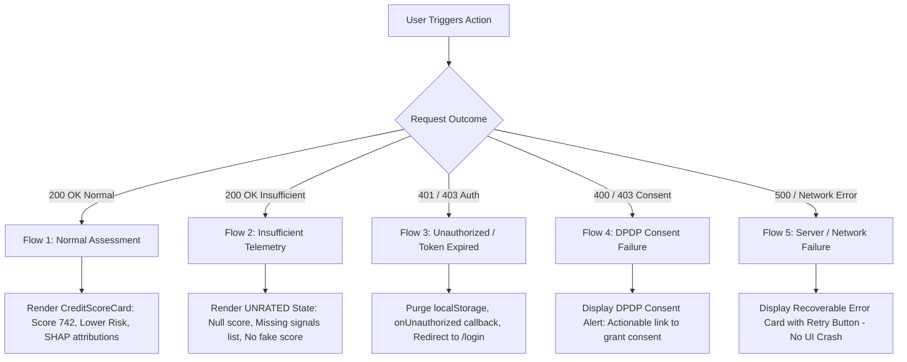

# Phase 11A — Frontend ↔ Backend Integration Analysis & Implementation Plan

**Project:** PARAKH — Alternative Credit Assessment Prototype (CX0506)  
**Branch:** `ml/credit-risk`  
**Role:** Frontend Integration Engineer  
**Status:** Analysis Complete — Ready for Phase 11B Implementation  
**Date:** September 2026  

---

## 1. Executive Summary

This document provides a comprehensive, repository-level analysis of the PARAKH frontend codebase and specifies the exact, minimal implementation plan required for Phase 11B to connect the existing Next.js frontend to the frozen, container-verified FastAPI backend (`POST /api/v1/applications/{application_id}/assess`) and the underlying Phase 9 LightGBM Volatility-Aware Credit Risk Model.

### High-Level Verdict: Ready with Specific Target Adjustments

The PARAKH frontend architecture is **already structurally aligned** with the FastAPI backend service. The dedicated API client package (`@parakh/api`) already exposes typed communication methods, JWT Bearer token management, HTTP error classification, and initial entity adapters. Key application pages—including `/user/applications/new`, `/user/results/[id]`, `/user/dashboard`, `/admin/applications/[id]`, and `/admin/analytics`—already invoke `@parakh/api` client methods rather than static mock fixtures.

However, a focused gap exists at the **adapter and display contract layer regarding unrated and insufficient evidence states**:

1. **Score Coercion Flaw:** The existing `adaptAssessment()` implementation in `frontend/packages/api/adapters.ts` coerces a `null` score into numerical `0` (`Number(backendAssessment.score ?? backendAssessment.credit_score ?? 0)`).
2. **Confidence Falsy Fallback Bug:** When the backend returns `confidence: 0.0` for insufficient evidence, JavaScript falsy evaluation in `(confidence || 0.85) * 100` unintentionally converts zero confidence into `85%`.
3. **Dropped Explanation Metadata:** Crucial ML explainability and governance fields produced by the backend—namely `is_insufficient_evidence`, `missing_signals`, `disclaimer`, `model_name`, and `model_version`—are currently omitted during adaptation.
4. **UI Display Vulnerability:** The `CreditScoreCard` and Reviewer dossier components do not check for an unrated state; if supplied with `score: 0`, they would render `0 / 850` and `0% Difficulty` rather than an explicit "No Credit Score Generated — Insufficient Evidence" state.

Because the core ML governance rule of the PARAKH project strictly prohibits **score fabrication on insufficient telemetry**, these adapter and component-level gaps must be resolved in Phase 11B before running end-to-end user journeys.

---

## 2. Frontend Architecture

The PARAKH user interface is structured as an npm workspaces monorepo:

```
frontend/
├── apps/
│   ├── web/                    # Next.js 16 App Router web portal (Applicant + Reviewer)
│   └── mobile/                 # React Native / Expo mobile prototype
├── packages/
│   ├── api/                    # @parakh/api: Central API client, HTTP adapters, transport types
│   ├── types/                  # @parakh/types: Shared domain models and entity interfaces
│   ├── validation/             # @parakh/validation: Zod schemas for input validation
│   └── design-tokens/          # @parakh/design-tokens: Shared styling and design system tokens
├── Dockerfile                  # Production Next.js container build
└── package.json                # Monorepo workspace configuration
```

### 2.1 Web Application Framework & Stack (`frontend/apps/web`)

- **Framework:** Next.js 16.3.5 (App Router architecture, React Server Components enabled where appropriate, client components designated via `'use client'`).
- **Runtime:** React 19.2.8, React DOM 19.2.8, Node.js 20+.
- **Styling:** Tailwind CSS v4 (`@tailwindcss/postcss`), Radix/Base-UI primitives (`@base-ui/react`), Lucide React 1.47 icons.
- **Animations & Visualizations:** Framer Motion 13.4 (`framer-motion`), Recharts 3.10 (`recharts`).
- **Data Validation:** Zod 4.6 (`zod`), `@parakh/validation`.

### 2.2 Entry Points & Routing Structure

The web application provides two distinct, role-guarded user portals within a unified layout structure:

| Route Path | Portal Role | Purpose & Data Interaction |
|---|---|---|
| `/` | Public | Platform landing page, value proposition, methodology preview (`HeroProductPreview`) |
| `/login` | Public | Unified login interface (supports `?role=applicant` and `?role=reviewer`) |
| `/signup` | Public | Account creation interface with DPDP Act consent acknowledgment |
| `/unauthorized` | Public | Role mismatch redirection screen (403 Forbidden surface) |
| `/user/dashboard` | Applicant | Applicant cockpit: summary metrics, active applications, latest assessment overview |
| `/user/applications` | Applicant | Historical credit evaluation applications list |
| `/user/applications/new` | Applicant | 5-step intake wizard: telemetry ingestion, DPDP consent, and assessment triggering |
| `/user/applications/[id]` | Applicant | Detailed application timeline, stage tracking, and review status |
| `/user/results/[id]` | Applicant | Full Credit Assessment Dossier: score card, AI insight, factor cards, SHAP chart |
| `/user/profile` | Applicant | Borrower profile details, connected accounts, KYC status |
| `/admin/dashboard` | Reviewer | Underwriter command center: portfolio analytics, active priority review queue |
| `/admin/applications` | Reviewer | Searchable and filterable queue of all credit evaluation applications |
| `/admin/applications/[id]` | Reviewer | Comprehensive Underwriter Review Dossier with HITL decision console |
| `/admin/analytics` | Reviewer | High-level portfolio risk distribution, sector risk breakdown, volume trends |
| `/admin/model-insights` | Reviewer | Model governance registry, active version metadata, governance card export |
| `/admin/profile` | Reviewer | Credit underwriter credential details and workstation settings |

### 2.3 State Management & Route Protection

- **Session State:** Handled centrally by `AuthProvider` in `frontend/apps/web/components/auth/AuthContext.tsx`. Manages user identity, JWT token synchronization with `localStorage`, and session cookies.
- **Page Data Fetching:** Implemented directly in client components using React hooks (`useState`, `useEffect`, `useCallback`) backed by `@parakh/api` client methods. Pages are resilient to browser refresh by re-fetching canonical state from the backend using route parameters (`[id]`).
- **Access Control:** Enforced via `RouteGuard` (`frontend/apps/web/components/auth/RouteGuard.tsx`), which validates user roles against route requirements (`APPLICANT` vs. `REVIEWER` / `ADMIN`) and redirects unauthenticated or unauthorized users.

---

## 3. API Layer Analysis (`@parakh/api`)

The authoritative communication boundary between the frontend and FastAPI backend is encapsulated in `frontend/packages/api/index.ts`.

### 3.1 Central Client (`ParakhApiClient`)

```typescript
export class ParakhApiClient {
  private baseUrl: string;
  private timeoutMs: number;
  private defaultHeaders: Record<string, string>;
  private token: string | null = null;
  private onUnauthorized?: () => void;
  // ...
}
```

- **Base URL Resolution:**
  ```typescript
  const envUrl =
    typeof process !== 'undefined' && process.env
      ? typeof window === 'undefined'
        ? process.env.INTERNAL_API_URL || process.env.NEXT_PUBLIC_API_URL
        : process.env.NEXT_PUBLIC_API_URL
      : undefined;
  this.baseUrl = config?.baseUrl || envUrl || 'http://localhost:8000';
  ```
  This configuration correctly distinguishes between browser-side requests (using `NEXT_PUBLIC_API_URL`, default `http://localhost:8000`) and internal SSR container requests (using `INTERNAL_API_URL`, default `http://backend:8000`).

- **Header Management:**
  Every outbound request sets `Content-Type: application/json` and `Accept: application/json`. When a token is active, it automatically injects:
  ```typescript
  headers['Authorization'] = `Bearer ${this.token}`;
  ```

- **Timeout & Idempotency Strategy:**
  - AbortController timeout set to 15 seconds (`15000ms`).
  - **Non-idempotent operations** (such as `POST /api/v1/applications/{id}/assess`) specify `maxRetries = 0`, ensuring that assessment runs are **never duplicated** over transient network glitches.
  - Idempotent GET operations allow a single retry (`maxRetries = 1`) with backoff for transient status codes (0, 408, 502–504).

### 3.2 Assessment API Methods

The client defines the following endpoints for assessment operations:

1. `triggerAssessment(applicationId: string, modelVersionId?: string): Promise<BackendAssessment>`
   - Method: `POST /api/v1/applications/{applicationId}/assess`
   - Invoked when an applicant or underwriter triggers credit risk evaluation.
2. `getLatestAssessmentByApplication(applicationId: string): Promise<BackendAssessment>`
   - Method: `GET /api/v1/applications/{applicationId}/assessments/latest`
   - Fetches the most recent assessment for an application.
3. `getAssessmentById(assessmentId: string): Promise<BackendAssessment>`
   - Method: `GET /api/v1/assessments/{assessmentId}`
   - Direct lookup by assessment UUID.
4. `getAssessmentsByApplication(applicationId: string): Promise<BackendAssessment[]>`
   - Method: `GET /api/v1/applications/{applicationId}/assessments`
   - Historical audit list of assessments for an application.

### 3.3 HTTP Error Classification (`ApiError`)

Transport and HTTP errors are normalized via `ApiError` (`frontend/packages/api/errors.ts`), which classifies status codes:
- `401 Unauthorized` $\to$ `code: 'UNAUTHORIZED'` (triggers `onUnauthorized` hook to clear session).
- `403 Forbidden` $\to$ `code: 'FORBIDDEN'` (permissions or consent failure).
- `404 Not Found` $\to$ `code: 'NOT_FOUND'` (missing application or assessment record).
- `409 Conflict` $\to$ `code: 'CONFLICT'` (e.g. duplicate active application).
- `422 Unprocessable Entity` $\to$ `code: 'SCHEMA_ERROR'` (FastAPI Pydantic validation error; parses loc/msg into readable text).
- `500 Server Error` $\to$ `code: 'SERVER_ERROR'`.
- Status `0` $\to$ `code: 'NETWORK_ERROR'`.
- Status `408` $\to$ `code: 'TIMEOUT'`.

---

## 4. Authentication Analysis

### 4.1 Token Storage & Lifecycle

1. **Storage Mechanism:**
   - On successful authentication via `api.login({ email, password })`, the backend returns `TokenResponse` (`access_token`, `token_type`, `user_id`, `role`, `email`).
   - The token is stored in browser `localStorage` under `parakh_auth_token` (`AUTH_TOKEN_KEY`).
   - A non-sensitive user summary is cached under `parakh_auth_session` (`AUTH_SESSION_KEY`).
   - A lightweight cookie `parakh_role` is set with `SameSite=Lax; max-age=86400` to inform middleware and SSR routes.
2. **Request Construction:**
   - In `AuthContext.tsx`, `initializeSession()` reads the token from `localStorage` on page mount and invokes `api.setToken(storedToken)`.
   - Subsequent calls made by any page using `api.*` automatically include `Authorization: Bearer <token>`.
3. **Automatic Clearance & Session Expiry:**
   - If any API call encounters an HTTP 401 response, `ParakhApiClient` invokes its `onUnauthorized` callback, clearing `this.token`.
   - `AuthContext` catches the 401 error, removes `AUTH_TOKEN_KEY` and `AUTH_SESSION_KEY` from `localStorage`, resets React user state to `null`, and redirects to `/login`.
4. **Security Audit:**
   - Tokens and raw credentials are never printed to console logs or rendered in UI elements.
   - Storage in `localStorage` is explicitly marked in code comments as a prototype implementation, with production recommendation to use HTTP-only cookies via reverse proxy.

---

## 5. Assessment Flow (Intake to Evaluation)

The end-to-end journey from application creation to assessment triggering is executed in `frontend/apps/web/app/user/applications/new/page.tsx`:

```
User Submits Wizard (5 Steps)
       │
       ▼
Step 1: Ensure ApplicantProfile exists
       │ POST /api/v1/applicants (or GET by user_id)
       ▼
Step 2: Register Credit Application
       │ POST /api/v1/applications
       │ Payload: applicant_profile_id, requested_loan_amount, loan_purpose, preferred_repayment_period
       ▼
Step 3: Register Statutory DPDP Act Consent
       │ POST /api/v1/consents
       │ Payload: application_id, applicant_profile_id, data_source: 'PLATFORM', purpose: '...', granted: true
       ▼
Step 4: Ingest Alternative Financial Telemetry
       │ POST /api/v1/applications/{id}/financial-signals
       │ Payload: income, volatility, active_days, payment_regularity, raw_signal_metadata
       ▼
Step 5: Trigger Model Assessment
       │ POST /api/v1/applications/{id}/assess
       │ FastAPI invokes AssessmentService -> MLAssessmentEngine -> MLModelAdapter -> RiskPredictor
       ▼
Step 6: Navigate to Results Dossier
       router.push(`/user/results/${activeApp.id}`)
```

### Flow Characteristics
- **Trigger Type:** Triggered explicitly by the user upon completing Step 5 of the intake wizard.
- **Application ID:** Generated as a UUID by PostgreSQL upon application creation in Step 2, and passed to all subsequent calls.
- **Progress Feedback:** The UI manages `submissionPhase` string state (`1/5: Verifying identity...`, `2/5: Registering application...`, `3/5: Registering consent...`, `4/5: Ingesting signals...`, `5/5: Executing assessment...`), presenting continuous visual feedback to the applicant.

---

## 6. Assessment Result Flow (Display & Underwriter Review)

Assessment results are presented in two dedicated views:

### 6.1 Applicant Results Dossier (`/user/results/[id]`)
- **Data Retrieval:**
  ```typescript
  // 1. Try querying latest assessment by application UUID
  rawAssessment = await api.getLatestAssessmentByApplication(id);
  // 2. Fallback to direct assessment UUID query if needed
  ```
- **Adapter Transformation:** `const adapted = adaptAssessment(rawAssessment);`
- **Rendered Sections:**
  1. **Top Utility Bar:** Back button, application UUID breadcrumb, Print and Share actions.
  2. **Hero Score Card (`CreditScoreCard`):** Visual score display, max score (850), Risk Level badge, secondary metrics.
  3. **Contextual AI Risk Insight (`AIInsightCard`):** Qualitative summary of volatility rebound velocity.
  4. **Why this assessment? Grid:** Two-column breakdown of Positive Factors vs. Attention Areas.
  5. **Explainable SHAP Contributions (`FeatureContributionCard`):** Relative feature impact divergence bars (+/- %).
  6. **Cashflow Volatility Tracking Chart (`CashflowVolatilityChart`):** Rebound curve and recovery velocity metric.

### 6.2 Reviewer Underwriter Dossier (`/admin/applications/[id]`)
- Fetches application, profile, latest assessment, and existing review outcomes.
- Displays identical assessment metrics (score, confidence, difficulty, SHAP contributions, rebound curve) alongside borrower telemetry.
- Provides a human-in-the-loop (HITL) control console allowing underwriters to:
  - Record a final outcome (`REVIEWED` $\to$ marks application `COMPLETED`).
  - Request additional verification (`ADDITIONAL_INFORMATION_REQUIRED` $\to$ marks application `UNDER_REVIEW`).
  - Escalate for manual review (`ESCALATED`).

---

## 7. TypeScript Contract Comparison

A precise comparison between the backend FastAPI response model, the API client transport interface, and the frontend domain type reveals the exact points of contract misalignment:

```
FastAPI Backend (CreditAssessmentResponse)
       │
       ▼ (HTTP JSON serialization)
@parakh/api Transport (BackendCreditAssessmentResponse)
       │
       ▼ (adaptAssessment mapper)
@parakh/types Domain Model (CreditAssessmentResult)
```

### Detailed Structural Comparison

| Field Name | FastAPI Schema (`CreditAssessmentResponse`) | Transport Type (`BackendCreditAssessmentResponse`) | Frontend Domain Model (`CreditAssessmentResult`) | Alignment Status |
|---|---|---|---|---|
| `id` | `UUID` | `string` | `string` | **Aligned** |
| `application_id` | `UUID` | `string` | `applicantId: string` | **Aligned** |
| `credit_score` | `Optional[int]` (0–1000 or `null`) | `number \| null` | N/A (represented by `score`) | **Aligned in transport** |
| `score` | `Optional[int]` (alias, or `null`) | `number \| null` | `score: number` (non-nullable) | ⚠️ **Mismatched Nullability** |
| `risk_probability` | `Optional[Decimal]` (0–1 or `null`) | `number \| string \| null` | `estimatedRepaymentDifficulty: number` | ⚠️ **Mismatched Nullability** |
| `risk_level` | `RiskLevel` (`LOWER`, `MODERATE`, `HIGHER`, `INSUFFICIENT`) | `BackendRiskLevel` | `RiskLevel` (`..._ESTIMATED RISK` / `INSUFFICIENT_...`) | **Aligned via adapter** |
| `confidence` | `Optional[Decimal]` (0–1 or `null`) | `number \| string \| null` | `modelConfidence: number` | ⚠️ **Mismatched Nullability & Fallback Bug** |
| `debt_to_income` | `Optional[Decimal]` | `number \| string \| null` | Subsumed into `volatilityProfile` | **Partially aligned** |
| `utilization` | `Optional[Decimal]` | `number \| string \| null` | Omitted | ⚠️ **Dropped in domain model** |
| `income_stability` | `Optional[Decimal]` | `number \| string \| null` | Subsumed into `volatilityProfile` | **Partially aligned** |
| `repayment_reliability`| `Optional[Decimal]` | `number \| string \| null` | Subsumed into `volatilityProfile` | **Partially aligned** |
| `assessment_status` | `str` (`COMPLETED`, `INSUFFICIENT_EVIDENCE`) | `string` | Omitted | ⚠️ **Dropped in domain model** |
| `model_name` | `Optional[str]` | `string \| null` | Omitted | ⚠️ **Dropped in domain model** |
| `model_version` | `Optional[str]` | `string \| null` | Omitted | ⚠️ **Dropped in domain model** |
| `key_factors` | `List[str]` | `string[]` | Split into positive/attention | **Aligned via parsing** |
| `explanation.shap_values` | `List[Dict[str, Any]]` | `Record<string, any>` | `featureContributions: SHAPContribution[]` | **Aligned via adapter** |
| `explanation.missing_signals` | `List[str]` | `Record<string, any>` | Omitted | ⚠️ **Dropped in domain model** |
| `explanation.is_insufficient_evidence` | `bool` | `Record<string, any>` | Omitted | ⚠️ **Dropped in domain model** |
| `explanation.disclaimer`| `str` | `Record<string, any>` | Omitted | ⚠️ **Dropped in domain model** |
| `assessed_at` | `datetime` | `string` | `assessedAt: string` | **Aligned** |

---

## 8. Existing `adaptAssessment()` Analysis

Inspection of `frontend/packages/api/adapters.ts` (lines 193–306) reveals the exact source code mechanics and defects:

### 8.1 Issue 1: Null Score Coercion to 0 (Line 197)

```typescript
// CURRENT CODE:
const score = Number(backendAssessment.score ?? backendAssessment.credit_score ?? 0);
```
- **Consequence:** When the backend refuses evaluation due to insufficient telemetry and returns `credit_score: null` and `score: null`, this line silently evaluates to `0`.
- **Impact:** Downstream components receive `score: 0`. The UI cannot distinguish between "No credit score generated" and an actual numeric score of 0.

### 8.2 Issue 2: Confidence Falsy Fallback Bug (Line 298)

```typescript
// CURRENT CODE:
modelConfidence: Math.round(confidence > 1 ? confidence : (confidence || 0.85) * 100),
```
- **Consequence:** When the backend outputs `confidence: 0.0` (as required for `INSUFFICIENT`), `(0.0 || 0.85)` evaluates to `0.85` because numeric `0` is falsy in JavaScript.
- **Impact:** A completely unconfident, insufficient evidence result is falsely reported in the UI as **`85% High Confidence`**.

### 8.3 Issue 3: Inverted Confidence Interval on Null Score (Line 280)

```typescript
// CURRENT CODE:
confidenceInterval: [Math.max(300, score - 35), Math.min(850, score + 35)],
```
- **Consequence:** When `score` is coerced to `0`, `score - 35 = -35` and `score + 35 = 35`.
- `Math.max(300, -35)` evaluates to `300`.
- `Math.min(850, 35)` evaluates to `35`.
- **Impact:** The resulting tuple is `[300, 35]`, where the lower bound exceeds the upper bound ($300 > 35$).

### 8.4 Issue 4: Dropped Explanation Metadata

The adapter currently only extracts `explanation.shap_values` and `explanation.recommendations`. It completely ignores:
- `explanation.is_insufficient_evidence`
- `explanation.missing_signals`
- `explanation.disclaimer`
- `backendAssessment.model_name`
- `backendAssessment.model_version`

---

## 9. Backend → Frontend Field Mapping

The following authoritative mapping table defines the transformation and UI routing for every field in the backend assessment contract:

| Backend Field | Backend Type | Frontend Type | Existing Adapter Mapping | Current UI Destination | Status | Phase 11B Action Required |
|---|---|---|---|---|---|---|
| `credit_score` | `Optional[int]` | `number \| null` | Coerced to `0` via fallback | `CreditScoreCard` (`score`) | ⚠️ Lossy | Update `CreditAssessmentResult.score` to `number \| null`. Preserve `null` in `adaptAssessment()`. |
| `score` | `Optional[int]` | `number \| null` | Coerced to `0` via fallback | `CreditScoreCard` (`score`) | ⚠️ Lossy | Same as `credit_score`; keep nullable. |
| `risk_probability` | `Optional[Decimal]` | `number \| null` | Coerced to `0%` difficulty | `CreditScoreCard` (`difficulty%`) | ⚠️ Lossy | Update `estimatedRepaymentDifficulty` to `number \| null`. Show `N/A` when null. |
| `risk_level` | `RiskLevel` | `RiskLevel` | `adaptRiskLevel()` | `RiskBadge` | ✅ Compatible | No changes needed in mapping. |
| `confidence` | `Optional[Decimal]` | `number \| null` | Falsy `0.0` converted to `85%` | `CreditScoreCard` (`confidence%`) | ⚠️ Defect | Fix falsy check: use `confidence != null ? Math.round(Number(confidence)*100) : null`. |
| `debt_to_income` | `Optional[Decimal]` | `number \| null` | Synthesized into monthly obligations | Admin telemetry card | ⚠️ Partial | Expose optional `debtToIncome?: number \| null` on `CreditAssessmentResult`. |
| `utilization` | `Optional[Decimal]` | `number \| null` | Unmapped | None | ⚠️ Omitted | Expose optional `utilization?: number \| null` on `CreditAssessmentResult`. |
| `income_stability` | `Optional[Decimal]` | `number \| null` | Mapped to volatility index | Volatility profile metrics | ⚠️ Partial | Guard against default synthesis if `income_stability` is null. |
| `repayment_reliability`| `Optional[Decimal]`| `number \| null` | Coerced to `0.95` fallback | Shock recovery metric | ⚠️ Partial | Guard against default synthesis if `repayment_reliability` is null. |
| `model_name` | `Optional[str]` | `string \| null` | Dropped | Admin Model Insights only | ⚠️ Omitted | Expose `modelName?: string \| null` on `CreditAssessmentResult` and display in dossier header. |
| `model_version` | `Optional[str]` | `string \| null` | Dropped | Admin Model Insights only | ⚠️ Omitted | Expose `modelVersion?: string \| null` on `CreditAssessmentResult` and display in dossier header. |
| `key_factors` | `List[str]` | `string[]` | Categorized to positive / attention | Factor cards on results page | ✅ Compatible | Preserve existing parsing; handle empty array gracefully. |
| `explanation.shap_values` | `List[Dict]` | `SHAPContribution[]` | Iterated and mapped | `FeatureContributionCard` | ✅ Compatible | Add empty state message when array is empty. |
| `explanation.missing_signals` | `List[str]` | `string[]` | Dropped | None | ⚠️ Missing | Expose `missingSignals?: string[]` on `CreditAssessmentResult`. Render warning box in UI. |
| `explanation.is_insufficient_evidence` | `bool` | `boolean` | Dropped | None | ⚠️ Missing | Expose `isInsufficientEvidence?: boolean` on `CreditAssessmentResult`. Drive unrated UI state. |
| `explanation.disclaimer` | `str` | `string` | Dropped | Static footer text only | ⚠️ Missing | Expose `disclaimer?: string` on `CreditAssessmentResult`. Bind to Methodology Modal / footer. |
| `assessment_status` | `str` | `string` | Dropped | None | ⚠️ Missing | Expose `assessmentStatus?: string` on `CreditAssessmentResult`. |
| `assessed_at` | `datetime` | `string` | Direct string pass-through | Header timestamp & breadcrumb | ✅ Compatible | No changes needed. |

---

## 10. Mock / Static Data Inventory

An exhaustive codebase search was conducted to identify all mock data sources and determine where real backend integration has already replaced them:

### 10.1 Mock Files in `frontend/apps/web/data/mock/`
1. **`user.ts` (313 lines):**
   - Contains `mockBorrowerProfile`, `mockUserAssessment` (hardcoded score 742), `mockUserApplications`, `mockConnectedDataSources`.
   - **Audit Result:** **Zero production pages import `mock/user.ts`.** All applicant pages (`/user/dashboard`, `/user/applications`, `/user/results/[id]`) fetch real data via `@parakh/api`. The file exists solely as an offline fixture.
2. **`admin.ts` (519 lines):**
   - Contains `mockPortfolioAnalytics`, `mockScoreDistributionBuckets`, `mockAdminApplications`, `mockOperationalAlerts`.
   - **Audit Result:** In `frontend/apps/web/app/admin/dashboard/page.tsx` (line 50), `mockOperationalAlerts` is imported to display operational notifications. All portfolio metrics and queue applications are fetched from the live backend via `api.getPortfolioAnalyticsAdapted()` and `api.getApplications()`.

### 10.2 Component Defaults
- **`CashflowVolatilityChart.tsx`:** Contains `defaultData` (12 weeks of synthetic cashflow points `W1`..`W12`) used as a fallback if the caller does not supply time-series data. Since the backend returns summary indices rather than individual weekly transaction points, this component displays the synthetic curve annotated with the **real, backend-computed rebound rate** (`recoveryRate`).
- **`HeroProductPreview.tsx`:** Contains static decorative values for landing page marketing demonstration. This is not an application or assessment screen and should not be modified.

---

## 11. Insufficient Evidence Handling

### 11.1 The Backend Contract for Refusal
When an application contains sparse, absent, or low-quality telemetry (e.g., zero active days, unlinked UPI, or missing income history), the backend `MLAssessmentEngine` refuses scoring and produces:
```json
{
  "credit_score": null,
  "score": null,
  "risk_probability": null,
  "risk_level": "INSUFFICIENT",
  "confidence": 0.0,
  "assessment_status": "INSUFFICIENT_EVIDENCE",
  "key_factors": [
    "Insufficient evidence: minimum 30 days of continuous platform telemetry required",
    "Missing primary income signal from connected digital accounts"
  ],
  "explanation": {
    "is_insufficient_evidence": true,
    "missing_signals": [
      "No digital payment or cashflow telemetry detected",
      "Tenure on gig platform under required threshold (< 30 days)"
    ],
    "shap_values": [],
    "disclaimer": "Alternative credit assessment prototype for underbanked gig workers under DPDP Act 2023. Not a formal credit bureau score."
  }
}
```

### 11.2 Required Frontend Behavior in Phase 11B
1. **Preserve `null`:** `adaptAssessment()` must return `score: null`, `estimatedRepaymentDifficulty: null`, `modelConfidence: 0`, and `isInsufficientEvidence: true`.
2. **Hero Score Display (`CreditScoreCard`):**
   - Check if `assessment.score === null` or `assessment.isInsufficientEvidence === true`.
   - Instead of rendering `0 / 850`, display:
     - Badge: `<RiskBadge riskLevel="INSUFFICIENT_EVIDENCE_MANUAL_REVIEW" />` (displays `MANUAL REVIEW REQUIRED`).
     - Large Text: **`UNRATED`** or **`No Score Generated`**.
     - Secondary text: *"Insufficient telemetry to safely synthesize an alternative credit score."*
     - Repayment Difficulty: Display `Uncalculated` or `N/A`.
     - Data Confidence: Display `0% (Insufficient telemetry)`.
3. **Missing Signals Alert:**
   - On `/user/results/[id]`, render a prominent notification banner listing the specific items from `assessment.missingSignals`.
   - Provide an actionable button: *"Connect Data Source"* or *"Update Application"*.
4. **SHAP Contributions (`FeatureContributionCard`):**
   - When `contributions.length === 0`, display an informative state: *"Feature attributions are unavailable because no predictive score was generated."*

---

## 12. Error and Loading States

### 12.1 Five Key User Flows & System Responses



1. **Flow 1: Normal Assessment:**
   - Full telemetry provided $\to$ Backend calculates Volatility-Aware score.
   - Status 200 OK $\to$ `CreditScoreCard` renders score (e.g. 742), Lower/Moderate/Higher Risk badge, SHAP contribution bars.
2. **Flow 2: Insufficient Evidence:**
   - Telemetry missing or sparse $\to$ Backend refuses score generation.
   - Status 200 OK with `risk_level: "INSUFFICIENT"` $\to$ UI displays Unrated dossier, lists missing signals, and prompts user to link verified data feeds.
3. **Flow 3: Unauthorized (401 / 403):**
   - Token expired or invalid credentials $\to$ `ParakhApiClient` detects 401, invokes `onUnauthorized()`, purges `localStorage`, and `RouteGuard` redirects user to `/login?redirect=...`.
4. **Flow 4: Consent Failure (400 / 403):**
   - Application lacks active DPDP consent $\to$ Backend refuses evaluation with `detail: "Active DPDP consent is required..."`.
   - UI catches `ApiError` and renders an alert card allowing the applicant to review and grant statutory consent.
5. **Flow 5: Backend / Server Failure (500, Network Timeout):**
   - Backend offline or database connection lost $\to$ `ParakhApiClient` throws `ApiError(code: 'SERVER_ERROR' | 'NETWORK_ERROR')`.
   - Pages render a non-crashing error boundary card (`<Card>...<RefreshCw /> Retry</Card>`), preventing Next.js white-screen crashes.

---

## 13. Environment Configuration

### 13.1 Variable Definitions
- `NEXT_PUBLIC_API_URL`: Browser-accessible FastAPI URL (default: `http://localhost:8000`). Used by client-side code running in user browsers.
- `INTERNAL_API_URL`: Docker network bridge URL (default: `http://backend:8000`). Used by Node.js server during Server-Side Rendering (SSR).

### 13.2 CORS Configuration Verification
In `backend/app/main.py`:
```python
app.add_middleware(
    CORSMiddleware,
    allow_origins=["*"],  # Permits browser requests from http://localhost:3000
    allow_credentials=True,
    allow_methods=["*"],
    allow_headers=["*"],
)
```
Browser-side fetch requests will not encounter CORS preflight rejections.

---

## 14. Required Phase 11B Changes

Phase 11B implementation should modify **only** the following files:

### 1. `frontend/packages/types/index.ts`
- Update `CreditAssessmentResult` interface:
  ```typescript
  export interface CreditAssessmentResult {
    id: string;
    applicantId: string;
    applicantName: string;
    score: number | null; // Allow null for unrated / insufficient evidence
    maxScore: number;
    riskLevel: RiskLevel;
    estimatedRepaymentDifficulty: number | null; // Allow null
    modelConfidence: number | null; // Allow null
    isInsufficientEvidence?: boolean;
    missingSignals?: string[];
    disclaimer?: string;
    modelName?: string | null;
    modelVersion?: string | null;
    debtToIncome?: number | null;
    utilization?: number | null;
    assessmentStatus?: string;
    volatilityProfile: VolatilityProfile;
    keyPositiveFactors: FactorSummary[];
    keyAttentionFactors: FactorSummary[];
    featureContributions: SHAPContribution[];
    actionableRecommendations: string[];
    assessedAt: string;
  }
  ```

### 2. `frontend/packages/api/adapters.ts`
- In `adaptAssessment()`:
  - Preserve `null` score: `const score = backendAssessment.score != null ? Number(backendAssessment.score) : (backendAssessment.credit_score != null ? Number(backendAssessment.credit_score) : null);`
  - Fix confidence calculation: avoid `(confidence || 0.85)` falsy evaluation.
  - Parse `explanation.is_insufficient_evidence`, `explanation.missing_signals`, `explanation.disclaimer`.
  - Extract `model_name`, `model_version`, and `assessment_status`.
  - Guard confidence interval against null score.

### 3. `frontend/packages/api/index.ts`
- Add convenience method `triggerAssessmentAdapted(applicationId: string, modelVersionId?: string): Promise<CreditAssessmentResult>` for symmetry with `getLatestAssessmentAdapted`.

### 4. `frontend/apps/web/components/shared/CreditScoreCard.tsx`
- Add conditional branch for `assessment.score === null || assessment.isInsufficientEvidence`:
  - Render "UNRATED" / "No Score Generated".
  - Suppress numerical score animation when score is null.
  - Render "N/A" for difficulty and "0% (Insufficient telemetry)" for confidence.

### 5. `frontend/apps/web/components/shared/FeatureContributionCard.tsx`
- Add empty state message when `contributions.length === 0`:
  - Render clean message explaining that feature attributions are unavailable for unrated evaluations.

### 6. `frontend/apps/web/app/user/results/[id]/page.tsx`
- Conditionally render a missing signals alert box when `assessment.isInsufficientEvidence === true` or `assessment.missingSignals?.length > 0`.
- Display dynamic model disclaimer from `assessment.disclaimer`.

### 7. `frontend/apps/web/app/admin/applications/[id]/page.tsx`
- Handle `assessment.score === null` in the underwriter header (display "Unrated / Insufficient Telemetry" instead of `0 / 850`).

### 8. `frontend/packages/api/test-api-adapters.ts`
- Add test coverage for `adaptAssessment` with nullable fields, `INSUFFICIENT` risk tier, missing signals, and empty SHAP arrays.

---

## 15. Files That Must Remain Untouched

To preserve the integrity of the frozen ML model and verified backend contracts, the following components **must strictly not be modified**:

| Directory / File | Reason for Preservation |
|---|---|
| `src/ml/**` | Frozen ML pipeline (feature engineering, LightGBM model, RiskPredictor, SHAP explainers) |
| `models/artifacts/**` | Frozen model manifest (`FINAL_MODEL.json`) and joblib artifact |
| `data/**` | Synthetic training, validation, and test datasets |
| `backend/app/assessment/ml_model_adapter.py` | Verified ML boundary adapter |
| `backend/app/assessment/ml_engine.py` | Verified ML assessment engine |
| `backend/app/models/**` | PostgreSQL database schemas |
| `backend/alembic/**` | Database migration scripts |
| `backend/app/api/v1/**` | Verified FastAPI routing and endpoints |
| `frontend/apps/mobile/**` | Out of scope for web portal integration |

---

## 16. Testing Plan for Phase 11B

### 16.1 Automated Adapter Suite (`frontend/packages/api/test-api-adapters.ts`)
Run via `npx tsx frontend/packages/api/test-api-adapters.ts`:
- **Test 1:** Normal Assessment Mapping:
  - Input: `credit_score: 750, risk_level: "LOWER", confidence: 0.91, risk_probability: 0.12`.
  - Assert: `score === 750`, `riskLevel === 'LOWER_ESTIMATED RISK'`, `modelConfidence === 91`, `estimatedRepaymentDifficulty === 12`.
- **Test 2:** Insufficient Evidence Mapping:
  - Input: `credit_score: null, score: null, risk_level: "INSUFFICIENT", confidence: 0.0, risk_probability: null, explanation: { is_insufficient_evidence: true, missing_signals: ["Signal A"], shap_values: [] }`.
  - Assert: `score === null`, `isInsufficientEvidence === true`, `modelConfidence === 0`, `estimatedRepaymentDifficulty === null`, `missingSignals.length === 1`, `featureContributions.length === 0`.
- **Test 3:** Falsy Confidence Regression Test:
  - Assert that `confidence: 0.0` does not evaluate to 85.

### 16.2 Web Flow Verification (`frontend/apps/web/test-applicant-flow.ts`)
Run via `npx tsx --tsconfig frontend/apps/web/tsconfig.json frontend/apps/web/test-applicant-flow.ts`:
- Verifies all 13 applicant portal lifecycle tests continue to pass against the FastAPI transport contracts.

---

## 17. Integration Risks & Mitigations

| Risk | Impact | Likelihood | Mitigation Strategy |
|---|---|---|---|
| **Score Fabrication on Refusal** | Severe governance violation; users misled about creditworthiness | High (if unpatched) | Patch `adaptAssessment()` to preserve `null` score; patch `CreditScoreCard` to display "UNRATED". |
| **Falsy Confidence Default** | Severe governance violation; unconfident model reports 85% confidence | High (if unpatched) | Replace `confidence \|\| 0.85` with explicit `confidence != null ? ... : null` check. |
| **CORS Preflight Failures** | Browser cannot communicate with backend | Low | Verified: FastAPI backend enables `allow_origins=["*"]` in `main.py`. |
| **Token Expiry Desynchronization** | Applicant submits wizard with stale token; assessment fails | Medium | Handled: `ParakhApiClient` detects 401, invokes `onUnauthorized()`, redirects gracefully to login. |
| **Empty SHAP Chart Crashing** | React rendering error on empty `shap_values` array | Medium | Handled: Added empty-state fallback message to `FeatureContributionCard`. |

---

## 18. Phase 11B Implementation Checklist

- [ ] **Step 1:** Update `@parakh/types` in `frontend/packages/types/index.ts` to support nullable `score`, `estimatedRepaymentDifficulty`, `modelConfidence`, and add `isInsufficientEvidence`, `missingSignals`, `disclaimer`, `modelName`, `modelVersion`.
- [ ] **Step 2:** Update `adaptAssessment()` in `frontend/packages/api/adapters.ts` to preserve `null` scores, eliminate falsy confidence bug, and map all explanation metadata.
- [ ] **Step 3:** Add `triggerAssessmentAdapted()` to `frontend/packages/api/index.ts`.
- [ ] **Step 4:** Add comprehensive unit tests in `frontend/packages/api/test-api-adapters.ts` covering nullable scores, `INSUFFICIENT` risk level, and empty SHAP arrays.
- [ ] **Step 5:** Run `npx tsx frontend/packages/api/test-api-adapters.ts` and verify 100% pass rate.
- [ ] **Step 6:** Update `CreditScoreCard.tsx` to handle `score === null` by displaying the "UNRATED / No Score Generated" view.
- [ ] **Step 7:** Update `FeatureContributionCard.tsx` to render an empty-state message when SHAP contributions array is empty.
- [ ] **Step 8:** Update `/user/results/[id]/page.tsx` to render missing signals and model disclaimer.
- [ ] **Step 9:** Update `/admin/applications/[id]/page.tsx` to handle unrated assessments in the underwriter view.
- [ ] **Step 10:** Run web integration tests (`test-applicant-flow.ts`) to ensure end-to-end compatibility.

---

## 19. Final Recommendation

The PARAKH frontend codebase is **architecturally ready** for backend integration. The necessary changes for Phase 11B are strictly non-disruptive, highly targeted, and isolated to:
1. Nullable type annotations in `@parakh/types`.
2. Safe null and metadata extraction in `@parakh/api/adapters.ts`.
3. Unrated state rendering in `CreditScoreCard.tsx` and the results dossier.

No backend changes, ML retrainings, model artifact edits, or database migrations are required. Once Phase 11B applies these targeted changes, the frontend will accurately and faithfully reflect the decisions of the frozen Volatility-Aware Credit Risk Model without score fabrication or information loss.
