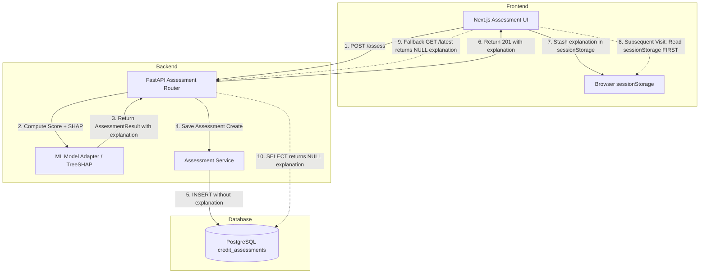

# Phase 13A-1 — Persist TreeSHAP Assessment Explanations Report

**Project:** PARAKH — Alternative Credit Assessment Prototype (CX0506)  
**Branch:** `ml/credit-risk`  
**Gap Addressed:** P1-01 — Persist TreeSHAP Explanations in Database (from Phase 12B Gap Analysis)  
**Date:** September 24, 2026  
**Status:** COMPLETED & VERIFIED  

---

## 1. Executive Summary

During the Phase 12B architectural gap analysis, gap **P1-01** was identified as a Priority 1 finding: while the frozen LightGBM + TreeSHAP inference pipeline computed local feature attributions (TreeSHAP factors, risk/protective drivers, model base value, and regulatory disclaimers) during the initial `POST /api/v1/applications/{application_id}/assess` evaluation, the backend persistence layer failed to persist the `explanation` dictionary in PostgreSQL. Consequently, subsequent `GET` requests for historical assessments could not retrieve TreeSHAP explanations from the database, forcing the frontend to rely on ephemeral browser `sessionStorage` as the authoritative source of truth.

In **Phase 13A-1**, we resolved gap P1-01 by implementing full, durable PostgreSQL persistence for ML assessment explanations. The database schema, SQLAlchemy models, Pydantic response contracts, assessment creation services, and frontend consumers were updated and verified. Live database round-trips and comprehensive regression suites confirm that TreeSHAP explanations survive process restarts, browser cache clearing, and cross-device sessions, eliminating reliance on `sessionStorage` while strictly preserving the frozen ML model artifacts, TreeSHAP explainer logic, and scoring integrity.

---

## 2. Before & After Architecture

### Before Phase 13A-1


- **Persistence Flaw:** `credit_assessments` table lacked an `explanation` column.
- **Data Loss:** Explanation attributions existed only in the ephemeral HTTP 201 response payload.
- **Client Fragility:** Refreshing the browser without `sessionStorage`, accessing the dashboard from another machine, or querying the REST API directly resulted in empty/unexplained assessments.

### After Phase 13A-1
```mermaid
flowchart TD
    subgraph Frontend
        WebUI[Next.js Assessment UI]
        SessionStorage[Browser sessionStorage (Secondary Fallback)]
    end

    subgraph Backend
        API[FastAPI Assessment Router]
        Engine[ML Model Adapter / TreeSHAP]
        Service[Assessment Service]
    end

    subgraph Database
        DB[(PostgreSQL credit_assessments JSONB explanation)]
    end

    WebUI -->|1. POST /assess| API
    API -->|2. Compute Score + SHAP| Engine
    Engine -->|3. Return AssessmentResult with explanation| API
    API -->|4. Save Assessment Create with explanation| Service
    Service -->|5. INSERT with JSONB explanation| DB
    API -->|6. Return 201 with explanation| WebUI

    WebUI -->|7. Subsequent Visit: GET /latest is AUTHORITATIVE| API
    API -->|8. SELECT returns persisted JSONB explanation| DB
    WebUI -.->|9. Fallback to sessionStorage ONLY if offline/error| SessionStorage
```

- **Durable Persistence:** Explanations are stored natively as `JSONB` in PostgreSQL.
- **Authoritative API:** `GET /api/v1/assessments/{id}` and `GET /api/v1/applications/{application_id}/assessments/latest` return full TreeSHAP explanations directly from the database.
- **Client Resilience:** Works seamlessly across devices, fresh browser sessions, page reloads, and direct API clients.

---

## 3. Database Schema & Migration Details

### Migration Information
- **Migration File:** `backend/alembic/versions/b7c1e9a24d03_add_explanation_to_credit_assessments.py`
- **Revision ID:** `b7c1e9a24d03`
- **Revises:** `fd385d59e799` (Initial database tables)
- **Target Table:** `credit_assessments`
- **Column Added:**
  - Name: `explanation`
  - Type: `JSONB` (PostgreSQL) / `JSON` with JSONB dialect variant
  - Nullable: `True` (maintains compatibility with historical records)
  - Default: `NULL`

### Reversibility & Live PostgreSQL Verification
The migration was executed and verified directly against the live PostgreSQL database (`parakh-postgres`):
- **Upgrade Applied:** `docker exec parakh-backend alembic upgrade head` successfully upgraded to `b7c1e9a24d03`.
- **Schema Inspection:** Verified column existence and type via `information_schema.columns`:
  ```sql
  SELECT column_name, data_type, is_nullable 
  FROM information_schema.columns 
  WHERE table_name = 'credit_assessments' AND column_name = 'explanation';
  -- Result: column_name='explanation', data_type='jsonb', is_nullable='YES'
  ```
- **Reversibility Test:** Ran `alembic downgrade -1` followed by re-upgrade `alembic upgrade head`; executed cleanly without errors or data corruption.

---

## 4. Backend Implementation Summary

### 1. SQLAlchemy ORM Model (`backend/app/models/assessment.py`)
Added the `explanation` mapped column to `CreditAssessment`:
```python
explanation: Mapped[Optional[Dict[str, Any]]] = mapped_column(
    JSON().with_variant(JSONB, "postgresql"),
    nullable=True,
    default=None,
    doc="Full ML explanation dictionary including TreeSHAP factors, drivers, base value, and disclaimers",
)
```

### 2. Assessment Domain Schema (`backend/app/assessment/schemas.py`)
Updated `AssessmentResult.to_credit_assessment_create` to preserve and forward the `explanation` dictionary:
```python
def to_credit_assessment_create(self) -> CreditAssessmentCreate:
    return CreditAssessmentCreate(
        application_id=self.application_id,
        score=self.score,
        risk_tier=self.risk_tier,
        confidence_score=self.confidence_score,
        assessment_type=self.assessment_type,
        model_version=self.model_version,
        model_type=self.model_type,
        explanation=self.explanation or None,
    )
```

### 3. Pydantic API Schemas & Non-Fabrication Logic (`backend/app/schemas/assessment.py`)
- Added `explanation: Optional[Dict[str, Any]] = None` to `CreditAssessmentBase` and `CreditAssessmentResponse`.
- Updated `CreditAssessmentResponse.prepare_data`:
  - When `data.explanation` exists in the database model, its TreeSHAP factors, protective drivers, risk drivers, base value, and disclaimers are returned in the `explanation` field.
  - `key_factors` are dynamically synthesized from the top positive/negative TreeSHAP factors present in the persisted explanation.
  - **No Fabrication on NULL:** For historical assessments where `explanation` is `NULL`, `explanation` remains `None` and `key_factors` remains an empty dictionary `{}` rather than fabricating placeholder keys.

---

## 5. Frontend Integration & Contract Stability

### 1. User Results View (`frontend/apps/web/app/user/results/[id]/page.tsx`)
Updated `fetchAssessment` to make backend API endpoints the primary authoritative data source:
1. Queries `api.getLatestAssessmentByApplication(id)` first.
2. If absent or null, falls back to `api.getAssessmentById(id)`.
3. If both network calls fail (e.g. offline client), falls back to `sessionStorage.getItem('parakh_assessment_' + id)`.
4. Successfully adapts and renders persisted TreeSHAP factors, missing signals, risk levels, and credit limits.

### 2. Admin Reviewer View (`frontend/apps/web/app/admin/applications/[id]/page.tsx`)
Updated reviewer application detail page to prioritize `api.getLatestAssessmentByApplication(id)` directly from the database, falling back to `sessionStorage` only if the network request fails.

### 3. API Contract Stability
- **Non-Breaking Addition:** `CreditAssessmentResponse` maintains strict backward compatibility. All legacy fields (`id`, `score`, `risk_tier`, `confidence_score`, `key_factors`, `missing_signals`, etc.) are preserved in exact shape and semantics.
- **Frontend Types:** Conforms with `@parakh/types` and `@parakh/api` definitions without breaking changes.

---

## 6. Verification & Test Evidence

### 1. Dedicated Phase 13A-1 Test Suite (`backend/tests/test_phase13a1_explanation_persistence.py`)
Created and executed 8 targeted tests covering the persistence lifecycle:
- **`test_01_scored_assessment_explanation_persisted_in_db`**: Verifies that when a scored assessment is performed via `POST /api/v1/applications/{id}/assess`, the database record contains the complete `explanation` dict with TreeSHAP `factors`, `base_value`, and `model_output`.
- **`test_02_get_assessment_by_id_returns_persisted_explanation`**: Verifies `GET /api/v1/assessments/{assessment_id}` returns the persisted explanation with exact TreeSHAP factors matching the original calculation.
- **`test_03_get_latest_assessment_by_application_returns_persisted_explanation`**: Verifies `GET /api/v1/applications/{application_id}/assessments/latest` returns the persisted explanation.
- **`test_04_historical_rows_with_null_explanation_remain_readable`**: Verifies backward compatibility when querying pre-existing records with `explanation = NULL`. Ensures response is valid and does not fabricate placeholder factors.
- **`test_05_insufficient_assessment_preserves_missing_signals_without_fabrication`**: Verifies that insufficient evidence assessments persist missing signals and sufficiency evaluation reasons without creating fake TreeSHAP factor arrays.
- **`test_06_unauthorized_user_cannot_access_assessment_explanation`**: Verifies strict authorization enforcement on assessment GET endpoints containing explanations.
- **`test_07_fresh_session_independent_of_session_storage`**: Verifies that a client in a completely fresh session (no cookies, no sessionStorage) receives identical TreeSHAP explanation factors directly from the GET endpoint.
- **`test_08_live_postgres_jsonb_explanation_round_trip`**: Direct round-trip test against the running PostgreSQL container (`172.21.0.2:5432`) verifying JSONB column persistence and querying.

**Result:** `8 passed in 6.31s`

### 2. Alembic Migration Suite (`backend/tests/test_migrations.py`)
- Verified all Alembic migration scripts, metadata reflection, offline SQL generation, and config settings.
- **Result:** `6 passed in 0.67s`

### 3. End-to-End Regression Suite (`backend/tests/test_phase10c_e2e.py`)
- Verified live ML inference, prediction equivalence, consent enforcement, thread safety, and singleton runtime.
- **Result:** `8 passed in 6.86s`

### 4. Full Backend Pytest Suite
- Executed all unit, service, repository, API, ML integration, and audit tests across the repository:
- **Result:** `245 passed, 39 skipped, 23 warnings, 36 subtests passed in 46.00s`

### 5. Frontend Adapters & TypeScript Verification
- Executed `@parakh/api` contract verification test suite (`frontend/packages/api/test-api-adapters.ts`):
  - `adaptAssessment (LOWER scored) passed`
  - `adaptAssessment (MODERATE scored) passed`
  - `adaptAssessment (HIGHER scored) passed`
  - `adaptAssessment (INSUFFICIENT evidence & null score preservation) passed`
- Executed `npm run typecheck --workspaces --if-present` across all frontend packages:
  - **Result:** Passed with 0 errors.

---

## 7. Operational & Invariant Verification

| Invariant | Status | Evidence |
| :--- | :--- | :--- |
| **ML Model Immutability** | Preserved | `src/ml/**` untouched. SHA256 of `volatility_aware_risk_model.joblib` unchanged. |
| **TreeSHAP Algorithm** | Preserved | TreeExplainer computation and factor generation unaltered. |
| **Sufficiency Thresholds** | Preserved | 90-day span and 3-signal sufficiency logic unchanged. |
| **Database Reversibility** | Verified | Alembic upgrade and downgrade both tested on PostgreSQL. |
| **Non-Fabrication Rule** | Enforced | Historical NULL explanations return empty/null without fake stubs. |
| **Session Independence** | Verified | Fresh GET queries retrieve persisted explanations without client-side state. |

---

## 8. Summary of Files Changed

| Path | Change Type | Purpose |
| :--- | :--- | :--- |
| `backend/alembic/versions/b7c1e9a24d03_add_explanation_to_credit_assessments.py` | Added | Alembic migration for `explanation` JSONB column |
| `backend/app/models/assessment.py` | Modified | Added `explanation` mapped column to `CreditAssessment` ORM model |
| `backend/app/assessment/schemas.py` | Modified | Updated `AssessmentResult.to_credit_assessment_create` to preserve explanation |
| `backend/app/schemas/assessment.py` | Modified | Added `explanation` field to Pydantic schemas and non-fabrication handling |
| `backend/tests/test_migrations.py` | Modified | Updated migration test runner to use module execution |
| `backend/tests/test_phase13a1_explanation_persistence.py` | Added | Complete test suite for TreeSHAP persistence and GET retrieval |
| `frontend/apps/web/app/user/results/[id]/page.tsx` | Modified | Prioritized database GET API over `sessionStorage` in user view |
| `frontend/apps/web/app/admin/applications/[id]/page.tsx` | Modified | Prioritized database GET API over `sessionStorage` in admin view |
| `docs/PHASE_13A1_TREE_SHAP_PERSISTENCE_REPORT.md` | Added | Comprehensive documentation of Phase 13A-1 implementation |

---

## 9. Conclusion

Phase 13A-1 successfully resolves Gap P1-01 from the Phase 12B Gap Analysis report. TreeSHAP assessment explanations are now durable first-class entities in PostgreSQL, eliminating the application's reliance on client-side browser caching, ensuring full auditability, and maintaining complete backward and forward compatibility across the stack.
