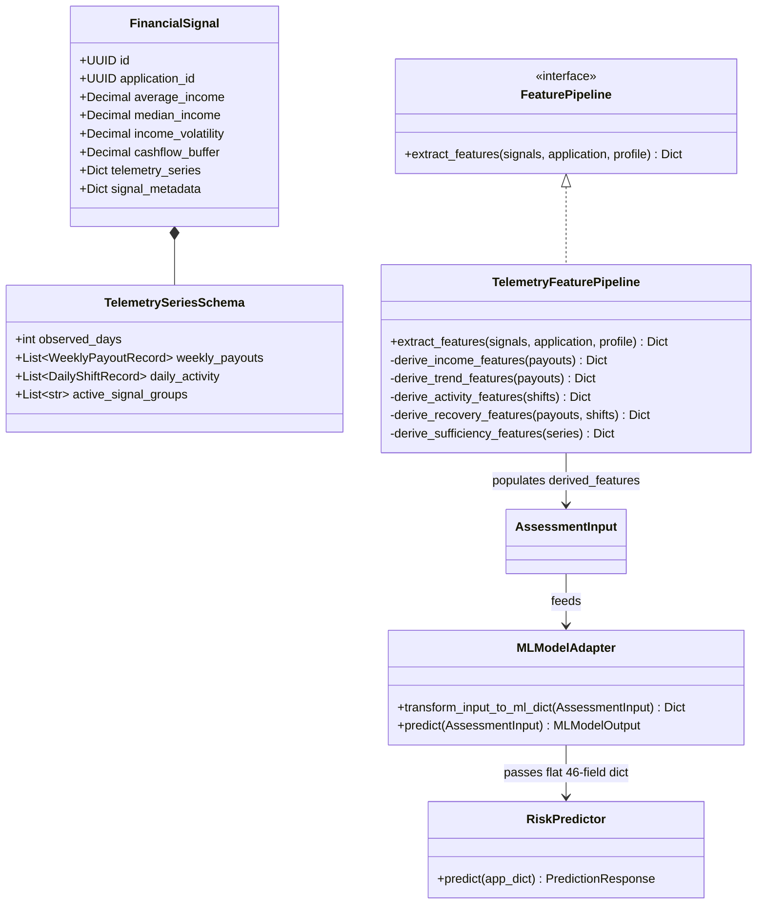

# Phase 13A-3 Analysis Report: P1-03 Runtime Telemetry to ML Feature Derivation

**Document ID:** `PARAKH-ANA-13A3-01`  
**Phase:** 13A-3-ANALYSIS (Analysis Only — No Code Changes)  
**Repository:** `Guneshbari/PARAKH`  
**Branch:** `ml/credit-risk`  
**Base Commits:**
- Phase 12B Gap Analysis: Frozen Baseline
- Phase 13A-1: TreeSHAP Explanation Persistence (`4826ce3`)
- Phase 13A-2: MLModelAdapter Sufficiency Fallback Fix (`c31a183`)  
**Status:** COMPLETE & AUTHORITATIVE  
**Date:** September 2026  

---

## 1. Executive Summary

This report delivers the authoritative, evidence-based technical analysis of **Gap P1-03** ("Runtime Telemetry to ML Feature Derivation") identified in the frozen Phase 12B Gap Analysis Report. In accordance with the execution constraints of Phase 13A-3-ANALYSIS, this phase is strictly **ANALYSIS ONLY**. No backend application code, frontend code, database schemas, migrations, ML models, or test suites have been modified.

### Key Findings

1. **Gap P1-03 Confirmed**: While the machine learning inference entry point (`RiskPredictor.predict` at `src/ml/inference/predictor.py` line 161) calls `FeatureEngineer.transform`, `FeatureEngineer` only computes **9 non-linear interaction terms** (`feat_eng_*`) from already-derived base features. The backend does **not** derive the 40 raw-telemetry ML features from granular transaction, shift, or payout streams at runtime.
2. **Underlying Data Void**: PostgreSQL currently contains **zero event-level or time-series tables** for transactions, platform payouts, daily shifts, order records, bank statements, or utility billing histories. The database stores only single-point scalar summaries on `financial_signals` (e.g., `average_income`, `median_income`, `income_volatility`, `cashflow_buffer`) and a freeform JSONB column `signal_metadata`.
3. **`PassthroughFeaturePipeline` is Passive**: Located at `backend/app/assessment/pipeline.py` (lines 41–69), `PassthroughFeaturePipeline.extract_features` performs **zero calculations**. It merely reads `signal_metadata` from the latest `FinancialSignal` entity, checks for prohibited keys, and copies whatever dictionary keys exist directly into `AssessmentInput.derived_features`.
4. **Current Runtime Feature Parity Breakdown**:
   - Out of the **46 pre-encoding inference inputs** required by `InputValidator.validate` (`src/ml/inference/input_validator.py` line 33):
     - **6** are raw application/profile fields (`requested_loan_amount`, `loan_tenure_months`, `years_working`, `average_working_days`, `gig_work_type`, `loan_purpose`).
     - **12** are derived at runtime inside `MLModelAdapter.transform_input_to_ml_dict` from single-point DB columns.
     - **3** are partially derived via discrete step heuristics (`feat_trend_slope_90d`, `feat_act_active_days_ratio`, `feat_suf_missing_ratio`).
     - **22** rely on passthrough keys from `signal_metadata`, falling back to static heuristic defaults (e.g., momentum = 1.0, consecutive drops = 1.0, recovery bounceback = 1.0, recovery days = 7.0, idle streak = 5.0).
     - **3** data sufficiency metrics (`feat_suf_observed_days`, `feat_suf_payout_count`, `feat_suf_group_count`) have **no database column** and default to `None` in the absence of explicit `signal_metadata`, correctly causing `InputValidator.check_data_sufficiency` to route applications to `INSUFFICIENT` without scoring (verified in Phase 13A-2).
   - Across the **64 model-ready columns** consumed by the frozen LightGBM model:
     - 40 base derived features + 4 raw numerics + 9 `FeatureEngineer` interactions + 11 one-hot encoded categories.
5. **Significant Train/Serve Skew**: In training (`src/data/synthetic/feature_derivation.py`), all 40 derived features were computed deterministically from 90-day event logs (`DailyActivityEvent` and `WeeklyPayoutEvent`). At runtime, missing event streams force `MLModelAdapter` to rely on static default approximations. Furthermore, three explicit mathematical formula discrepancies were discovered in `MLModelAdapter`'s fallback derivation (`feat_bur_loan_to_income`, `feat_int_vol_x_buffer`, and `feat_int_trend_x_dti`).
6. **Recommended Minimal Architecture**: Implementation of **Option D (Hybrid Telemetry Contract)** in a future implementation phase:
   - Extend `FinancialSignal` with a structured `telemetry_series` JSONB payload storing trailing weekly payout amounts and daily shift counts.
   - Replace `PassthroughFeaturePipeline` with an authentic `TelemetryFeaturePipeline` implementing the exact mathematical formulas from `src/data/synthetic/feature_derivation.py`.
   - Correct the mathematical formula discrepancies in `MLModelAdapter`.
   - Preserve `InputValidator`, the Phase 13A-2 sufficiency gate, the frozen LightGBM model artifact, and data minimization boundaries (`PROHIBITED_FIELDS`).

---

## 2. P1-03 Problem Statement

### 2.1 The Frozen Gap Reference

In `docs/PHASE_12B_FRONTEND_BACKEND_ML_GAP_ANALYSIS_REPORT.md` (Section 3.2, Finding P1-03), the frozen gap analysis established:

> *"The FeatureEngineer is invoked by RiskPredictor, but the backend does not currently derive the full rich raw-telemetry feature contract from sufficiently granular runtime transaction/event data before inference. Instead, PassthroughFeaturePipeline merely propagates pre-existing metadata."*

### 2.2 Architectural Context

The PARAKH system is architected around an alternative credit risk paradigm for gig economy workers who lack formal credit histories. The core hypothesis of the model (documented in `docs/ml-specification.md` and `docs/ml-data-specification.md`) is that high income volatility is not synonymous with high credit default risk if that volatility is accompanied by rapid recovery elasticity, sufficient cashflow buffers, disciplined platform engagement, and low existing debt service.

To evaluate this hypothesis, the ML model (`VolatilityAwareRiskModel`) requires 40 specialized features representing 90 days of behavioral and financial history.

However, a fundamental disconnect exists between the training environment and the production backend:
- **Training Reality**: Trained on synthetic data (`src/data/synthetic/`), where every applicant had 90 days of simulated daily activity events (`hours_worked`, `gross_earnings`, `net_earnings`, `is_weekend`) and weekly payouts (`payout_timestamp`, `net_amount`). All 40 features were calculated via mathematical aggregation over these time-series.
- **Backend Reality**: The backend was developed with single-point summary models (`FinancialSignal`). When an application is submitted, the frontend or mock seeder submits aggregate figures (`average_income`, `income_volatility`). Neither the API nor the database captures the underlying event-level time-series.
- **Inference Reality**: `RiskPredictor` requires all 46 pre-encoding columns as non-null floating-point values (except sufficiency features, which may be `None` to trigger refusal routing). To bridge the gap, `MLModelAdapter` injects hardcoded static defaults for 22 features whenever they are not provided in `signal_metadata`.

---

## 3. Current End-to-End Data Flow

The following data-flow diagram illustrates the current path from frontend submission to ML inference, highlighting where data is persisted, where defaults are substituted, and where `FeatureEngineer` executes:

```mermaid
flowchart TD
    subgraph Frontend["1. Frontend Layer (Next.js)"]
        UI["New Application Wizard\n(/user/applications/new)\nCollects: income, rent, utilities, EMI, tenure, platform"]
        FE_API["ParakhApiClient.recordFinancialSignals()\nSubmits: summary aggregates +\nsignal_metadata (primary_platform, income_frequency, typical_recovery_days)"]
        UI --> FE_API
    end

    subgraph BackendAPI["2. Backend Ingestion Layer (FastAPI)"]
        EP_FS["POST /api/v1/applications/{id}/financial-signals\n(app/api/v1/financial_signals.py)"]
        EP_ASSESS["POST /api/v1/applications/{id}/assess\n(app/api/v1/assessments.py)"]
        FE_API --> EP_FS
        FE_API --> EP_ASSESS
    end

    subgraph Persistence["3. Database Layer (PostgreSQL)"]
        DB_APP["applications table\n(requested_loan_amount, loan_purpose)"]
        DB_PROF["applicant_profiles table\n(gig_work_type, years_working)"]
        DB_SIG["financial_signals table\n(average_income, median_income,\nincome_volatility, cashflow_buffer, signal_metadata)"]
        EP_FS --> DB_SIG
    end

    subgraph ServiceLayer["4. Assessment Orchestration Layer"]
        SVC["AssessmentService.assess_application()\n(app/services/assessment.py:196)"]
        PIPE["PassthroughFeaturePipeline.extract_features()\n(app/assessment/pipeline.py:48)\nAction: Copies signals[-1].signal_metadata"]
        INPUT_OBJ["AssessmentInput.from_domain_objects()\n(app/assessment/schemas.py:175)\nCombines: app, profile, signal, derived_features"]
        
        EP_ASSESS --> SVC
        DB_APP -.-> SVC
        DB_PROF -.-> SVC
        DB_SIG -.-> SVC
        SVC --> PIPE
        PIPE --> INPUT_OBJ
    end

    subgraph EngineBoundary["5. Assessment Engine Boundary"]
        ENGINE["MLAssessmentEngine.assess()\n(app/assessment/ml_engine.py:165)"]
        ADAPTER["MLModelAdapter.predict()\n(app/assessment/ml_model_adapter.py:107)"]
        TRANSFORM["MLModelAdapter.transform_input_to_ml_dict()\n(app/assessment/ml_model_adapter.py:137)\nConstructs flat 46-field application dict\n• 12 derived from DB\n• 3 partial heuristics\n• 22 defaulted / passthrough\n• 3 sufficiency (None if missing)"]
        
        INPUT_OBJ --> ENGINE
        ENGINE --> ADAPTER
        ADAPTER --> TRANSFORM
    end

    subgraph MLInference["6. ML Inference Pipeline (RiskPredictor)"]
        VAL["InputValidator.validate(app_dict)\n(src/ml/inference/input_validator.py:107)\nChecks 46 columns, bounds, prohibited fields"]
        GATE{"InputValidator.check_data_sufficiency()\n(src/ml/inference/input_validator.py:217)\nobserved_days >= 30\npayout_count >= 4\ngroup_count >= 2"}
        
        REFUSAL["OutputFormatter.format_insufficient()\n(risk_tier=INSUFFICIENT, score=None)"]
        
        FE_ENG["FeatureEngineer.transform(single_row_df)\n(src/ml/features/feature_engineering.py:774)\nDerives 9 feat_eng_* interaction features"]
        PREPROC["CreditRiskPreprocessor.transform()\n(src/ml/data/preprocessing.py:161)\nLog1p, RobustScaler, OneHotEncoder -> 64 cols"]
        LGBM["VolatilityAwareRiskModel.predict_proba()\n(LightGBM Booster)"]
        SHAP["TreeShapExplainer.explain_instance()\n(TreeSHAP Local Attributions)"]
        OUT_FMT["OutputFormatter.format_scored()\n(PredictionResponse)"]
        
        TRANSFORM --> VAL
        VAL --> GATE
        GATE -- Fails (Missing/Low Telemetry) --> REFUSAL
        GATE -- Passes --> FE_ENG
        FE_ENG --> PREPROC
        PREPROC --> LGBM
        LGBM --> SHAP
        SHAP --> OUT_FMT
    end

    subgraph OutputMapping["7. Output Mapping & Persistence"]
        MAP["MLModelAdapter.map_prediction_to_output()\n(Transforms PredictionResponse -> MLModelOutput)"]
        DB_ASSESS["credit_assessments table\n(score, risk_probability, risk_tier, explanation JSONB)"]
        
        REFUSAL --> MAP
        OUT_FMT --> MAP
        MAP --> SVC
        SVC --> DB_ASSESS
    end
```



### Boundary-by-Boundary Field Contract

| Boundary | Sending Component | Receiving Component | Input Fields | Output Fields | Data Transformations & Defaults | Persistence |
| :--- | :--- | :--- | :--- | :--- | :--- | :--- |
| **B1** | Frontend Wizard | `POST /financial-signals` | User form inputs | `FinancialSignalCreate` | Calculates client-side `income_volatility` heuristic; hardcodes `active_days=24`, `payment_regularity=0.95`, `platform_rating=4.85`, `repayment_reliability=0.96`. | Persisted in `financial_signals` table |
| **B2** | API Router | `FinancialSignalService` | `FinancialSignalCreate` dict | `FinancialSignal` ORM | Validates ownership; checks for `PROHIBITED_FIELDS`; persists record. | PostgreSQL `financial_signals` |
| **B3** | `AssessmentService` | `PassthroughFeaturePipeline` | `Sequence[FinancialSignal]` | `Dict[str, Any]` (`derived_features`) | Inspects `signals[-1].signal_metadata`; verifies absence of prohibited keys; returns dictionary unmodified. | In-memory |
| **B4** | `AssessmentService` | `AssessmentInput` | Domain entities + `derived_features` | `AssessmentInput` Pydantic model | Extracts scalar attributes from `Application`, `ApplicantProfile`, and `FinancialSignal`. Extra fields forbidden. | In-memory |
| **B5** | `MLAssessmentEngine` | `MLModelAdapter` | `AssessmentInput` | Flat `Dict[str, Any]` (46 fields) | `transform_input_to_ml_dict` evaluates 46 keys. Applies fallbacks for 22 missing telemetry features. Leaves sufficiency keys as `None` if missing. | In-memory |
| **B6** | `MLModelAdapter` | `RiskPredictor` | Flat 46-field application dict | `PredictionResponse` | Validates schema bounds; executes sufficiency gate; executes `FeatureEngineer` (9 interactions); scales and encodes (64 columns); executes model scoring and TreeSHAP. | In-memory |
| **B7** | `RiskPredictor` | `AssessmentService` | `PredictionResponse` | `CreditAssessmentCreate` | Formats SHAP attributions into `explanation` JSONB; maps risk tier to `RiskLevel`. | Persisted in `credit_assessments` table |

---

## 4. Runtime Data Source Inventory

A systematic audit across `backend/app/models/`, `backend/alembic/versions/`, and the live PostgreSQL database confirms exactly nine application tables:

```
1. users
2. applicant_profiles
3. applications
4. consents
5. financial_signals
6. model_versions
7. credit_assessments
8. review_outcomes
9. audit_logs
```

### 4.1 Detailed Entity & Field Inventory

| Table Name | Model Class & File | Relevant Feature Fields | Granularity | Historical Depth | API Accessibility |
| :--- | :--- | :--- | :--- | :--- | :--- |
| `applicant_profiles` | `ApplicantProfile`<br>`app/models/applicant.py` | `gig_work_type`<br>`years_working`<br>`average_working_days`<br>`business_or_loan_purpose` | Single profile per user | Current snapshot (no historical versions) | `GET /api/v1/applicants/me`<br>`POST /api/v1/applicants/` |
| `applications` | `Application`<br>`app/models/application.py` | `requested_loan_amount`<br>`loan_purpose`<br>`preferred_repayment_period` | Single record per credit request | Point-in-time loan request | `GET /api/v1/applications/{id}`<br>`POST /api/v1/applications/` |
| `financial_signals` | `FinancialSignal`<br>`app/models/financial_signal.py` | `average_income`<br>`median_income`<br>`income_volatility`<br>`income_trend`<br>`active_days`<br>`payment_regularity`<br>`cashflow_buffer`<br>`existing_obligation`<br>`platform_rating`<br>`repayment_reliability`<br>`signal_metadata` | Summary snapshot associated with application | Single aggregate measurement period (`start`, `end`) | `GET /api/v1/applications/{id}/financial-signals`<br>`POST /api/v1/applications/{id}/financial-signals` |
| `consents` | `Consent`<br>`app/models/consent.py` | `data_source`<br>`purpose`<br>`granted`<br>`revoked_at` | Record per consent grant | Active or revoked state | `GET /api/v1/applications/{id}/consents`<br>`POST /api/v1/applications/{id}/consents` |
| `credit_assessments` | `CreditAssessment`<br>`app/models/assessment.py` | `credit_score`<br>`risk_probability`<br>`risk_level`<br>`confidence`<br>`explanation` (JSONB) | Single assessment outcome record | Output artifact | `GET /api/v1/applications/{id}/assessments` |

### 4.2 Prohibited Fields Policy

In accordance with Section 4 of `docs/backend-ml-integration-contract.md` and `src/ml/constants.py` (lines 86–104), strict data-minimization rules forbid the following fields across all schemas, inputs, and database tables:
- `raw_transactions`, `raw_bank_statements`, `raw_upi_transactions`, `raw_upi_logs`, `upi_vpa`
- `bank_account_number`, `bank_credentials`, `banking_login_credentials`, `password`, `password_hash`
- `merchant_name`, `merchant_description`, `merchant_details`
- `gps_coordinates`, `location_history`, `contact_list`, `contacts`

---

## 5. `signal_metadata` Analysis

### 5.1 Schema & Storage Definition

In `backend/app/models/financial_signal.py` (lines 136–139), `signal_metadata` is declared as:
```python
signal_metadata: Mapped[Optional[Dict[str, Any]]] = mapped_column(
    JSON().with_variant(JSONB, "postgresql"),
    nullable=True,
)
```
Its schema definition in `backend/app/schemas/financial_signal.py` (line 27) describes it as:
```python
signal_metadata: Optional[Dict[str, Any]] = Field(None, description="Non-sensitive structured summary attributes")
```

### 5.2 Live Database Query Results

A direct query against the live PostgreSQL database (`SELECT DISTINCT jsonb_object_keys(signal_metadata) FROM financial_signals;`) revealed that across all records in the database, only **eight distinct keys** exist:
1. `feat_suf_observed_days` (seeded demo / test fixture)
2. `feat_suf_payout_count` (seeded demo / test fixture)
3. `feat_suf_group_count` (seeded demo / test fixture)
4. `feat_inc_cv_90d` (seeded demo / test fixture)
5. `active_days` (seeded demo / test fixture)
6. `primary_platform` (frontend form submission)
7. `income_frequency` (frontend form submission)
8. `typical_recovery_days` (frontend form submission)

### 5.3 Classification & Analysis Questions

| Question | Finding & Evidence |
| :--- | :--- |
| **Which keys can `signal_metadata` contain?** | Any JSON object that does not contain keys listed in `PROHIBITED_FIELDS`. |
| **Which keys are actually populated by the frontend?** | Only 3 keys: `primary_platform`, `income_frequency`, `typical_recovery_days` (`frontend/apps/web/app/user/applications/new/page.tsx` lines 265–269). |
| **Which keys are actually stored in PostgreSQL?** | The 3 frontend keys above, plus 5 ML sufficiency and feature keys injected exclusively by `scripts/seed_demo_data.py` and backend test fixtures. |
| **Which keys are read by `MLModelAdapter`?** | Lines 248–251 of `ml_model_adapter.py` search for: `feat_suf_observed_days` (or `observed_days`), `feat_suf_payout_count` (or `payout_count`), `feat_suf_group_count` (or `group_count`), and `feat_suf_missing_ratio` (or `missing_ratio`). Lines 269–308 read any of the 40 feature names if present in the dictionary. |
| **Can `signal_metadata` reconstruct a historical transaction/event series?** | **NO**. It contains no timestamped records, no payout arrays, no daily shift logs, and no event sequences. |
| **Is `signal_metadata` raw telemetry or summary data?** | **Summary data**. It is a generic JSON container for key-value scalar attributes. It does not represent raw telemetry. |

---

## 6. `PassthroughFeaturePipeline` Analysis

### 6.1 Code Implementation

The complete implementation of `PassthroughFeaturePipeline` at `backend/app/assessment/pipeline.py` (lines 41–69) is as follows:

```python
class PassthroughFeaturePipeline(FeaturePipeline):
    """Default fallback feature pipeline used prior to ML feature engineering integration.

    Preserves any existing signal_metadata without fabricating synthetic numbers or
    violating data-minimization policies.
    """

    def extract_features(
        self,
        signals: Sequence[Any],
        application: Optional[Any] = None,
        applicant_profile: Optional[Any] = None,
    ) -> Dict[str, Any]:
        """Extract features by propagating existing non-sensitive signal_metadata."""
        features: Dict[str, Any] = {}
        if signals:
            latest = signals[-1] if isinstance(signals, (list, tuple)) else signals
            if isinstance(latest, dict):
                meta = latest.get("signal_metadata")
            else:
                meta = getattr(latest, "signal_metadata", None)

            if isinstance(meta, dict):
                # Ensure no prohibited privacy-invasive keys are passed
                _check_for_prohibited_keys(meta)
                features.update(meta)

        return features
```

### 6.2 Audit Summary

- **Inputs Accepted**: `signals` (Sequence of `FinancialSignal` ORM objects), `application` (ignored), `applicant_profile` (ignored).
- **Transformations Performed**: **None**.
- **Fields Derived**: **None**.
- **Fields Defaulted**: **None**.
- **Fields Propagated**: Whatever key-value pairs are stored in `signals[-1].signal_metadata`.
- **Verdict**: `PassthroughFeaturePipeline` is a placeholder passthrough. It does not perform feature extraction, feature engineering, mathematical transformation, or telemetry aggregation. It was designed as an interface boundary (`FeaturePipeline`) to be replaced by a concrete feature derivation pipeline.

---

## 7. `FeatureEngineer` Analysis

### 7.1 Location and Invocation

- **Source Code**: `src/ml/features/feature_engineering.py` (lines 743–850).
- **Invocation Point**: `src/ml/inference/predictor.py` (Step 3 of `RiskPredictor.predict`, lines 158–166):
  ```python
  # Step 3 — Feature engineering (transform only — never fit on inference data)
  raw_df = pd.DataFrame([application])
  try:
      engineered_df = self._engineer.transform(raw_df)
  except Exception as exc:
      raise RuntimeError(f"Feature engineering failed for the submitted application: {exc}") from exc
  ```

### 7.2 What `FeatureEngineer.transform` Actually Does

`FeatureEngineer.transform(X)` expects an input DataFrame that **already contains all 46 pre-encoding fields** (including the 40 `feat_*` features). It computes exactly **9 higher-order interaction features**:

```python
# 1. Volatility relative to baseline earnings
result_df["feat_eng_vol_to_baseline"] = cv / (median_inc / 10000.0 + 0.1)
result_df["feat_eng_downside_to_median"] = np.sqrt(np.maximum(downside_var, 0.0)) / (median_inc + 1.0)

# 2. Volatility conditioned on trajectory / trend
result_df["feat_eng_vol_x_trend"] = cv * (momentum - 1.0)

# 3. Volatility conditioned on recovery and resilience
result_df["feat_eng_vol_to_bounceback"] = cv / (bounceback + 0.1)
result_df["feat_eng_recovery_velocity"] = bounceback / (days_recover / 7.0 + 1.0)

# 4. Volatility conditioned on liquidity & cashflow buffer
result_df["feat_eng_buffer_burn_coverage"] = burn_months * (buffer_loan + 0.1)
result_df["feat_eng_vol_cushion_ratio"] = (buffer_loan + 0.1) / (cv + 0.05)

# 5. Volatility conditioned on debt & obligation capacity
result_df["feat_eng_dti_risk_multiplier"] = total_dti * (1.0 + cv)
monthly_installment = loan_amount / np.maximum(tenure, 1.0)
result_df["feat_eng_installment_floor_coverage"] = p25_inc / (monthly_installment + 1.0)
```

### 7.3 Architectural Conclusion

`FeatureEngineer` is not broken. It executes perfectly as a downstream tabular transformer. However:
- It **does not** compute `feat_inc_median_90d`, `feat_inc_cv_90d`, `feat_trend_slope_90d`, `feat_rec_bounceback_ratio`, or any of the other 35 derived base features from raw events.
- It expects those 40 features to have been derived *before* tabular inference.
- Therefore, invoking `FeatureEngineer` inside `RiskPredictor` cannot resolve P1-03 because the missing derivation is *upstream* of `RiskPredictor`.

---

## 8. Complete ML Feature Contract Matrix

The following matrix documents all **64 model-ready features** consumed by the frozen `VolatilityAwareRiskModel` (`models/artifacts/FINAL_MODEL.json`).

| # | Feature Name | Group | Type | Training-Time Source (`src/data/synthetic/`) | Current Runtime Source (`MLModelAdapter`) | Runtime Derivation Status | Requires Event Telemetry? |
| :---: | :--- | :--- | :--- | :--- | :--- | :--- | :---: |
| 1 | `feat_inc_median_90d` | `income_level` | numeric | `Median({P_k})` over 90 days | `derived` or `FinancialSignal.median_income` | `RUNTIME_PASSTHROUGH` / `DEFAULT` | Yes (Payouts) |
| 2 | `feat_inc_p25_90d` | `income_level` | numeric | `Quantile_25({P_k})` over 90 days | `derived` or `median * 0.85` | `RUNTIME_PASSTHROUGH` / `DEFAULT` | Yes (Payouts) |
| 3 | `feat_inc_cv_90d` | `income_volatility` | numeric | `StdDev(P_k) / Mean(P_k)` | `derived` or `FinancialSignal.income_volatility` | `RUNTIME_PASSTHROUGH` / `DEFAULT` | Yes (Payouts) |
| 4 | `feat_inc_downside_var` | `income_volatility` | numeric | `(1/K)*sum(min(0, P_k - Med)^2)` | `derived` or `(median * 0.20)^2` | `RUNTIME_PASSTHROUGH` / `DEFAULT` | Yes (Payouts) |
| 5 | `feat_trend_slope_90d` | `income_trend` | numeric | OLS slope across weekly payouts | Discrete map from `FinancialSignal.income_trend` | `PARTIALLY_DERIVED` | Yes (Payouts) |
| 6 | `feat_trend_momentum_30_90` | `income_trend` | numeric | `Mean(P_last4) / Mean(P_all)` | `derived` or default `1.0` | `RUNTIME_PASSTHROUGH` / `DEFAULT` | Yes (Payouts) |
| 7 | `feat_act_active_days_ratio` | `work_activity` | numeric | `Count(active_days) / 90` | `FinancialSignal.active_days / 90.0` | `PARTIALLY_DERIVED` | Yes (Shifts) |
| 8 | `feat_act_zero_earn_weeks` | `work_activity` | numeric | `Count(weeks where P_k == 0)` | `derived` or default `1.0` | `RUNTIME_PASSTHROUGH` / `DEFAULT` | Yes (Payouts) |
| 9 | `feat_rec_bounceback_ratio` | `resilience_recovery` | numeric | Post-trough peak / pre-trough baseline | `derived` or default `1.0` | `RUNTIME_PASSTHROUGH` / `DEFAULT` | Yes (Events) |
| 10 | `feat_rec_days_to_recover` | `resilience_recovery` | numeric | Days from trough to >= 85% baseline | `derived` or default `7.0` | `RUNTIME_PASSTHROUGH` / `DEFAULT` | Yes (Events) |
| 11 | `feat_liq_buffer_to_loan` | `liquidity_buffer` | numeric | `cashflow_buffer / requested_loan_amount` | Computed from DB columns | `RUNTIME_DERIVED` | No (Scalar) |
| 12 | `feat_liq_burn_months` | `liquidity_buffer` | numeric | `buffer / (debt + living_cost)` | `derived` or default `2.0` | `RUNTIME_PASSTHROUGH` / `DEFAULT` | Partial |
| 13 | `feat_bur_dti_ratio` | `debt_burden` | numeric | `existing_debt / monthly_income` | Computed from DB columns | `RUNTIME_DERIVED` | No (Scalar) |
| 14 | `feat_bur_installment_dti` | `debt_burden` | numeric | `installment / monthly_income` | Computed from DB columns | `RUNTIME_DERIVED` | No (Scalar) |
| 15 | `feat_bur_total_dti` | `debt_burden` | numeric | `dti_ratio + installment_dti` | Computed from DB columns | `RUNTIME_DERIVED` | No (Scalar) |
| 16 | `feat_suf_observed_days` | `data_sufficiency` | numeric | Days from first event to t0 | Extracted from `signal_metadata` | `MISSING_RUNTIME_SOURCE` | Yes (Timestamps) |
| 17 | `feat_suf_payout_count` | `data_sufficiency` | numeric | Count of settled payout cycles | Extracted from `signal_metadata` | `MISSING_RUNTIME_SOURCE` | Yes (Payouts) |
| 18 | `feat_suf_group_count` | `data_sufficiency` | numeric | Count of active core signal groups | Extracted from `signal_metadata` | `MISSING_RUNTIME_SOURCE` | Yes (Catalog) |
| 19 | `feat_suf_missing_ratio` | `data_sufficiency` | numeric | Ratio of unpopulated optional fields | Conditional logic on sufficiency | `PARTIALLY_DERIVED` | No |
| 20 | `feat_inc_mean_90d` | `income_level` | numeric | Arithmetic mean of payouts | `derived` or `FinancialSignal.average_income` | `RUNTIME_PASSTHROUGH` / `DEFAULT` | Yes (Payouts) |
| 21 | `feat_inc_trimmed_mean` | `income_level` | numeric | 10% symmetric trimmed mean | `derived` or `median` | `RUNTIME_PASSTHROUGH` / `DEFAULT` | Yes (Payouts) |
| 22 | `feat_inc_iqr_ratio` | `income_volatility` | numeric | `(P75 - P25) / Median` | `derived` or default `0.35` | `RUNTIME_PASSTHROUGH` / `DEFAULT` | Yes (Payouts) |
| 23 | `feat_inc_min_max_ratio` | `income_volatility` | numeric | `Min(P_k) / Max(P_k)` | `derived` or default `0.50` | `RUNTIME_PASSTHROUGH` / `DEFAULT` | Yes (Payouts) |
| 24 | `feat_trend_consec_drops` | `income_trend` | numeric | Max consecutive drops in payouts | `derived` or default `1.0` | `RUNTIME_PASSTHROUGH` / `DEFAULT` | Yes (Payouts) |
| 25 | `feat_act_max_idle_streak` | `work_activity` | numeric | Max consecutive inactive days | `derived` or default `5.0` | `RUNTIME_PASSTHROUGH` / `DEFAULT` | Yes (Shifts) |
| 26 | `feat_act_weekend_intensity` | `work_activity` | numeric | Weekend active hours / total hours | `derived` or default `0.30` | `RUNTIME_PASSTHROUGH` / `DEFAULT` | Yes (Shifts) |
| 27 | `feat_rec_max_drawdown` | `resilience_recovery` | numeric | Max peak-to-trough percentage drop | `derived` or default `0.20` | `RUNTIME_PASSTHROUGH` / `DEFAULT` | Yes (Payouts) |
| 28 | `feat_ten_years_working` | `tenure_standing` | numeric | Profile years working | `ApplicantProfile.years_working` | `RUNTIME_DERIVED` | No (Profile) |
| 29 | `feat_ten_platform_rating` | `tenure_standing` | numeric | Platform rating [1.0, 5.0] | `FinancialSignal.platform_rating` | `RUNTIME_DERIVED` | No (Scalar) |
| 30 | `feat_ten_trips_completed` | `tenure_standing` | numeric | `round(total_hours * 1.6)` | `derived` or default `500.0` | `RUNTIME_PASSTHROUGH` / `DEFAULT` | Yes (Shifts) |
| 31 | `feat_ten_cancellation_rate` | `tenure_standing` | numeric | Cancellation rate [0.0, 1.0] | `derived` or default `0.03` | `RUNTIME_PASSTHROUGH` / `DEFAULT` | Partial |
| 32 | `feat_liq_net_margin` | `liquidity_buffer` | numeric | `(net_earnings - expenses) / gross` | `derived` or default `0.15` | `RUNTIME_PASSTHROUGH` / `DEFAULT` | Yes (Events) |
| 33 | `feat_pay_utility_on_time` | `payment_discipline` | numeric | On-time utility ratio [0.0, 1.0] | `FinancialSignal.payment_regularity` | `RUNTIME_DERIVED` | No (Scalar) |
| 34 | `feat_pay_max_bill_delay` | `payment_discipline` | numeric | Max days past due on bills | `derived` or default `3.0` | `RUNTIME_PASSTHROUGH` / `DEFAULT` | Yes (Billing) |
| 35 | `feat_pay_repay_reliability` | `payment_discipline` | numeric | Alternative repayment track record | `FinancialSignal.repayment_reliability` | `RUNTIME_DERIVED` | No (Scalar) |
| 36 | `feat_bur_loan_to_income` | `debt_burden` | numeric | `loan_amount / annual_income` | Computed from DB (formula mismatch) | `RUNTIME_DERIVED` | No (Scalar) |
| 37 | `feat_int_vol_x_recovery` | `volatility_interaction` | numeric | `cv * recovery_days` | Computed from features | `RUNTIME_DERIVED` | Downstream |
| 38 | `feat_int_vol_x_buffer` | `volatility_interaction` | numeric | `cv / (buffer + 0.1)` | Computed from features (formula mismatch) | `RUNTIME_DERIVED` | Downstream |
| 39 | `feat_int_trend_x_dti` | `volatility_interaction` | numeric | `slope * (1.0 + total_dti)` | Computed from features (formula mismatch) | `RUNTIME_DERIVED` | Downstream |
| 40 | `feat_int_resilience_idx` | `volatility_interaction` | numeric | `bounceback / (cv + 0.05)` | `derived` or default `50.0` | `RUNTIME_PASSTHROUGH` / `DEFAULT` | Downstream |
| 41 | `requested_loan_amount` | `loan_context` | numeric | `Application.requested_loan_amount` | `Application.requested_loan_amount` | `RUNTIME_DERIVED` | No (Loan) |
| 42 | `loan_tenure_months` | `loan_context` | numeric | `Application.loan_tenure_months` | `Application.preferred_repayment_period` | `RUNTIME_DERIVED` | No (Loan) |
| 43 | `years_working` | `profile_context` | numeric | `ApplicantProfile.years_working` | `ApplicantProfile.years_working` | `RUNTIME_DERIVED` | No (Profile) |
| 44 | `average_working_days` | `profile_context` | numeric | `ApplicantProfile.average_working_days`| `ApplicantProfile.average_working_days`| `RUNTIME_DERIVED` | No (Profile) |
| 45 | `feat_eng_vol_to_baseline` | `engineered_volatility`| numeric | `FeatureEngineer.transform` | `FeatureEngineer.transform` | `RUNTIME_DERIVED` | Downstream |
| 46 | `feat_eng_downside_to_median`| `engineered_volatility`| numeric | `FeatureEngineer.transform` | `FeatureEngineer.transform` | `RUNTIME_DERIVED` | Downstream |
| 47 | `feat_eng_vol_x_trend` | `engineered_volatility`| numeric | `FeatureEngineer.transform` | `FeatureEngineer.transform` | `RUNTIME_DERIVED` | Downstream |
| 48 | `feat_eng_vol_to_bounceback`| `engineered_volatility`| numeric | `FeatureEngineer.transform` | `FeatureEngineer.transform` | `RUNTIME_DERIVED` | Downstream |
| 49 | `feat_eng_recovery_velocity`| `engineered_volatility`| numeric | `FeatureEngineer.transform` | `FeatureEngineer.transform` | `RUNTIME_DERIVED` | Downstream |
| 50 | `feat_eng_buffer_burn_coverage`| `engineered_volatility`| numeric | `FeatureEngineer.transform` | `FeatureEngineer.transform` | `RUNTIME_DERIVED` | Downstream |
| 51 | `feat_eng_vol_cushion_ratio`| `engineered_volatility`| numeric | `FeatureEngineer.transform` | `FeatureEngineer.transform` | `RUNTIME_DERIVED` | Downstream |
| 52 | `feat_eng_dti_risk_multiplier`| `engineered_volatility`| numeric | `FeatureEngineer.transform` | `FeatureEngineer.transform` | `RUNTIME_DERIVED` | Downstream |
| 53 | `feat_eng_installment_floor_coverage`| `engineered_volatility`| numeric | `FeatureEngineer.transform` | `FeatureEngineer.transform` | `RUNTIME_DERIVED` | Downstream |
| 54 | `gig_work_type_DELIVERY` | `encoded_categorical` | binary | One-hot encoded from `gig_work_type` | `CreditRiskPreprocessor.transform` | `RUNTIME_DERIVED` | No (OHE) |
| 55 | `gig_work_type_FREELANCE_MICRO` | `encoded_categorical` | binary | One-hot encoded from `gig_work_type` | `CreditRiskPreprocessor.transform` | `RUNTIME_DERIVED` | No (OHE) |
| 56 | `gig_work_type_HOME_SERVICES` | `encoded_categorical` | binary | One-hot encoded from `gig_work_type` | `CreditRiskPreprocessor.transform` | `RUNTIME_DERIVED` | No (OHE) |
| 57 | `gig_work_type_LOGISTICS` | `encoded_categorical` | binary | One-hot encoded from `gig_work_type` | `CreditRiskPreprocessor.transform` | `RUNTIME_DERIVED` | No (OHE) |
| 58 | `gig_work_type_OTHER` | `encoded_categorical` | binary | One-hot encoded from `gig_work_type` | `CreditRiskPreprocessor.transform` | `RUNTIME_DERIVED` | No (OHE) |
| 59 | `gig_work_type_RIDE_HAILING` | `encoded_categorical` | binary | One-hot encoded from `gig_work_type` | `CreditRiskPreprocessor.transform` | `RUNTIME_DERIVED` | No (OHE) |
| 60 | `loan_purpose_EQUIPMENT_PURCHASE` | `encoded_categorical` | binary | One-hot encoded from `loan_purpose` | `CreditRiskPreprocessor.transform` | `RUNTIME_DERIVED` | No (OHE) |
| 61 | `loan_purpose_OTHER` | `encoded_categorical` | binary | One-hot encoded from `loan_purpose` | `CreditRiskPreprocessor.transform` | `RUNTIME_DERIVED` | No (OHE) |
| 62 | `loan_purpose_PERSONAL_EMERGENCY`| `encoded_categorical` | binary | One-hot encoded from `loan_purpose` | `CreditRiskPreprocessor.transform` | `RUNTIME_DERIVED` | No (OHE) |
| 63 | `loan_purpose_VEHICLE_MAINTENANCE`| `encoded_categorical` | binary | One-hot encoded from `loan_purpose` | `CreditRiskPreprocessor.transform` | `RUNTIME_DERIVED` | No (OHE) |
| 64 | `loan_purpose_WORKING_CAPITAL` | `encoded_categorical` | binary | One-hot encoded from `loan_purpose` | `CreditRiskPreprocessor.transform` | `RUNTIME_DERIVED` | No (OHE) |

---

## 9. 40 Derived Feature Trace

This section traces all 40 derived features by functional group, contrasting the authoritative training calculation in `src/data/synthetic/feature_derivation.py` against the runtime logic in `MLModelAdapter.transform_input_to_ml_dict`.

### Group 1: Income Level (4 Features)
1. **`feat_inc_median_90d`**:
   - *Training*: `calculate_median_income(payout_amounts)` — exact median of trailing weekly net payouts ($P_k$).
   - *Runtime*: `derived.get("feat_inc_median_90d", safe_median)`. If absent, defaults to `median_income` or `average_income` from `FinancialSignal` or `7000.0`.
2. **`feat_inc_p25_90d`**:
   - *Training*: `calculate_p25_income(payout_amounts, median_val)` — 25th percentile exclusive quantile of payouts.
   - *Runtime*: `derived.get("feat_inc_p25_90d", safe_median * 0.85)`. Static fallback at 85% of median.
3. **`feat_inc_mean_90d`**:
   - *Training*: `calculate_mean_income(payout_amounts)` — arithmetic mean of weekly payouts.
   - *Runtime*: `derived.get("feat_inc_mean_90d", avg_inc or safe_median)`. Falls back to `average_income` or median.
4. **`feat_inc_trimmed_mean`**:
   - *Training*: `calculate_trimmed_mean_income(payout_amounts)` — 10% symmetric trimmed mean of payouts.
   - *Runtime*: `derived.get("feat_inc_trimmed_mean", safe_median)`. Falls back directly to median.

### Group 2: Income Volatility & Dispersion (4 Features)
5. **`feat_inc_cv_90d`**:
   - *Training*: `calculate_income_cv(payout_amounts)` — coefficient of variation $\sigma / \mu$ bounded to $[0.0, 5.0]$.
   - *Runtime*: `derived.get("feat_inc_cv_90d", vol_cv or 0.25)`. Falls back to `FinancialSignal.income_volatility` or `0.25`.
6. **`feat_inc_downside_var`**:
   - *Training*: `calculate_downside_variance(payout_amounts, median_val)` — semi-variance of payouts below median: $\frac{1}{K}\sum \min(0, P_k - \text{Med})^2$.
   - *Runtime*: `derived.get("feat_inc_downside_var", (safe_median * 0.20) ** 2)`. Fabricated heuristic assuming 20% downside deviation.
7. **`feat_inc_iqr_ratio`**:
   - *Training*: `calculate_iqr_ratio(payout_amounts, median_val)` — $(P_{75} - P_{25}) / \text{Median}$ bounded to $[0.0, 10.0]$.
   - *Runtime*: `derived.get("feat_inc_iqr_ratio", 0.35)`. Static fallback `0.35`.
8. **`feat_inc_min_max_ratio`**:
   - *Training*: `calculate_min_max_ratio(payout_amounts)` — $\min(P_k) / \max(P_k)$ bounded to $[0.0, 1.0]$.
   - *Runtime*: `derived.get("feat_inc_min_max_ratio", 0.50)`. Static fallback `0.50`.

### Group 3: Trajectory & Momentum (3 Features)
9. **`feat_trend_slope_90d`**:
   - *Training*: `calculate_trend_slope(payout_amounts)` — OLS regression slope over weeks $t=1..K$ (INR/week).
   - *Runtime*: Mapped from string `income_trend` (`GROWING` $\rightarrow 150.0$, `DECLINING` $\rightarrow -200.0$, `STABLE` $\rightarrow 15.0$, else $0.0$).
10. **`feat_trend_momentum_30_90`**:
    - *Training*: `calculate_trend_momentum(payout_amounts)` — mean of last 4 weeks payouts divided by mean of full 90 days.
    - *Runtime*: `derived.get("feat_trend_momentum_30_90", 1.0)`. Static fallback `1.0` (neutral momentum).
11. **`feat_trend_consec_drops`**:
    - *Training*: `calculate_consecutive_drops(payout_amounts)` — max consecutive cycles where $P_k < P_{k-1}$.
    - *Runtime*: `derived.get("feat_trend_consec_drops", 1.0)`. Static fallback `1.0`.

### Group 4: Work Activity & Consistency (4 Features)
12. **`feat_act_active_days_ratio`**:
    - *Training*: `calculate_active_days_ratio(daily_events)` — count of days with active shifts divided by 90.
    - *Runtime*: `float(active_days) / 90.0` from `FinancialSignal.active_days` (default `0.65`).
13. **`feat_act_zero_earn_weeks`**:
    - *Training*: `calculate_zero_earning_weeks(payout_amounts)` — count of weeks with zero net earnings.
    - *Runtime*: `derived.get("feat_act_zero_earn_weeks", 1.0)`. Static fallback `1.0`.
14. **`feat_act_max_idle_streak`**:
    - *Training*: `calculate_max_idle_streak(daily_events)` — longest consecutive streak of inactive calendar days.
    - *Runtime*: `derived.get("feat_act_max_idle_streak", 5.0)`. Static fallback `5.0`.
15. **`feat_act_weekend_intensity`**:
    - *Training*: `calculate_weekend_intensity(daily_events)` — weekend active hours divided by total active hours.
    - *Runtime*: `derived.get("feat_act_weekend_intensity", 0.30)`. Static fallback `0.30`.

### Group 5: Resilience & Recovery (3 Features)
16. **`feat_rec_bounceback_ratio`**:
    - *Training*: `calculate_recovery_metrics(...)` — post-trough peak earnings divided by pre-trough baseline.
    - *Runtime*: `derived.get("feat_rec_bounceback_ratio", 1.0)`. Static fallback `1.0`.
17. **`feat_rec_days_to_recover`**:
    - *Training*: `calculate_recovery_metrics(...)` — calendar days from trough to restoring $\ge 85\%$ baseline income.
    - *Runtime*: `derived.get("feat_rec_days_to_recover", 7.0)`. Static fallback `7.0`.
18. **`feat_rec_max_drawdown`**:
    - *Training*: `calculate_max_drawdown(payout_amounts)` — peak-to-trough percentage contraction $(\text{Peak} - \text{Trough}) / \text{Peak}$.
    - *Runtime*: `derived.get("feat_rec_max_drawdown", 0.20)`. Static fallback `0.20`.

### Group 6: Platform Tenure & Standing (4 Features)
19. **`feat_ten_years_working`**:
    - *Training*: Direct profile attribute `applicant_profile.years_working`.
    - *Runtime*: Direct mapping from `ApplicantProfile.years_working` (default `0.0`).
20. **`feat_ten_platform_rating`**:
    - *Training*: Direct profile attribute `applicant_profile.platform_rating`.
    - *Runtime*: Direct mapping from `FinancialSignal.platform_rating` (default `4.50`).
21. **`feat_ten_trips_completed`**:
    - *Training*: `round(total_hours * 1.6)` from daily events.
    - *Runtime*: `derived.get("feat_ten_trips_completed", 500.0)`. Static fallback `500.0`.
22. **`feat_ten_cancellation_rate`**:
    - *Training*: Profile attribute `applicant_profile.cancellation_rate`.
    - *Runtime*: `derived.get("feat_ten_cancellation_rate", 0.03)`. Static fallback `0.03`.

### Group 7: Liquidity & Financial Buffer (3 Features)
23. **`feat_liq_buffer_to_loan`**:
    - *Training*: `cashflow_buffer / requested_loan_amount`.
    - *Runtime*: Derived from `FinancialSignal.cashflow_buffer / Application.requested_loan_amount` (default `0.20`).
24. **`feat_liq_burn_months`**:
    - *Training*: `cashflow_buffer / (existing_debt + living_cost)`.
    - *Runtime*: `derived.get("feat_liq_burn_months", 2.0)`. Static fallback `2.0`.
25. **`feat_liq_net_margin`**:
    - *Training*: `(total_net - expenses) / total_gross` over 90 days.
    - *Runtime*: `derived.get("feat_liq_net_margin", 0.15)`. Static fallback `0.15`.

### Group 8: Payment Discipline & Alternative History (3 Features)
26. **`feat_pay_utility_on_time`**:
    - *Training*: Profile attribute `applicant_profile.payment_reliability`.
    - *Runtime*: Direct mapping from `FinancialSignal.payment_regularity` (default `0.90`).
27. **`feat_pay_max_bill_delay`**:
    - *Training*: `int(round((1.0 - payment_reliability) * 30.0))`.
    - *Runtime*: `derived.get("feat_pay_max_bill_delay", 3.0)`. Static fallback `3.0`.
28. **`feat_pay_repay_reliability`**:
    - *Training*: Profile attribute `applicant_profile.payment_reliability`.
    - *Runtime*: Direct mapping from `FinancialSignal.repayment_reliability` (default `0.95`).

### Group 9: Debt Burden & Capacity (4 Features)
29. **`feat_bur_dti_ratio`**:
    - *Training*: `existing_debt / (median_weekly_income * 4.333333)`.
    - *Runtime*: `FinancialSignal.existing_obligation / (safe_median * 4.33)` (default `0.25`).
30. **`feat_bur_installment_dti`**:
    - *Training*: `contractual_emi / (median_weekly_income * 4.333333)`.
    - *Runtime*: `(req_amount / tenure) / (safe_median * 4.33)`.
31. **`feat_bur_total_dti`**:
    - *Training*: `dti_ratio + installment_dti`.
    - *Runtime*: `dti_ratio + installment_dti`.
32. **`feat_bur_loan_to_income`**:
    - *Training*: `loan_amount / (median_weekly_income * 52.0)` — principal divided by **annualized** income.
    - *Runtime*: `req_amount / monthly_income_est` — principal divided by **monthly** income. **Defect**: This introduces an unintended ~12x calculation discrepancy between training and serving.

### Group 10: Data Sufficiency & Missingness (4 Features)
33. **`feat_suf_observed_days`**:
    - *Training*: `history.observed_days` (calendar days from first event to $t_0$).
    - *Runtime*: Extracted strictly from `signal_metadata`. If missing, set to `None`.
34. **`feat_suf_payout_count`**:
    - *Training*: `len(history.weekly_payouts)` (count of settled payout cycles).
    - *Runtime*: Extracted strictly from `signal_metadata`. If missing, set to `None`.
35. **`feat_suf_group_count`**:
    - *Training*: `calculate_group_count(history, profile, application)` (active non-empty signal categories).
    - *Runtime*: Extracted strictly from `signal_metadata`. If missing, set to `None`.
36. **`feat_suf_missing_ratio`**:
    - *Training*: `count(null_optional_fields) / 18.0`.
    - *Runtime*: Evaluated dynamically: `0.0` if all sufficiency metrics present and valid; else `1.0`.

### Group 11: Volatility Interactions from Contract (4 Features)
37. **`feat_int_vol_x_recovery`**:
    - *Training*: `cv * recovery_days`.
    - *Runtime*: `f_inc_cv_90d * f_rec_days_to_recover`.
38. **`feat_int_vol_x_buffer`**:
    - *Training*: `cv / (buffer_to_loan + 0.1)`.
    - *Runtime*: `f_inc_cv_90d * f_liq_buffer_to_loan`. **Defect**: Multiplies instead of dividing by buffer + 0.1.
39. **`feat_int_trend_x_dti`**:
    - *Training*: `slope * (1.0 + total_dti)`.
    - *Runtime*: `f_trend_slope_90d * f_bur_dti_ratio`. **Defect**: Uses pre-existing DTI rather than $(1.0 + \text{total\_dti})$.
40. **`feat_int_resilience_idx`**:
    - *Training*: `bounceback / (cv + 0.05)`.
    - *Runtime*: `derived.get("feat_int_resilience_idx", 50.0)`. Static fallback `50.0`.

---

## 10. Training vs Runtime Feature Parity

### Parity Classification Summary

```
Total Pre-Encoding Model Features:       46
├── Truly Runtime-Derived (DB fields):  12 (26.1%)
├── Partially Derived (Heuristics):      3  (6.5%)
├── Raw Context Inputs:                  6 (13.0%)
├── Passthrough / Default Approximated: 22 (47.8%)
└── Genuinely Missing (Sufficiency):     3  (6.5%)
```

### Categorical Breakdown Table

| Category | Count | Features Included | Primary Cause |
| :--- | :---: | :--- | :--- |
| **Authentically Derived at Runtime** | 12 | `feat_liq_buffer_to_loan`, `feat_bur_dti_ratio`, `feat_bur_installment_dti`, `feat_bur_total_dti`, `feat_bur_loan_to_income`, `feat_ten_years_working`, `feat_ten_platform_rating`, `feat_pay_utility_on_time`, `feat_pay_repay_reliability`, `feat_int_vol_x_recovery`, `feat_int_vol_x_buffer`, `feat_int_trend_x_dti` | Direct mathematical derivation from scalar DB columns in `applications`, `applicant_profiles`, and `financial_signals`. |
| **Partially Derived / Discrete Heuristics** | 3 | `feat_trend_slope_90d` (mapped from discrete enum), `feat_act_active_days_ratio` (`active_days / 90`), `feat_suf_missing_ratio` (conditional flag) | Derived from coarse aggregate fields rather than granular observations. |
| **Raw Context Inputs** | 6 | `requested_loan_amount`, `loan_tenure_months`, `years_working`, `average_working_days`, `gig_work_type`, `loan_purpose` | Direct input from application and profile entities. |
| **Passthrough with Static Fallbacks** | 22 | `feat_inc_median_90d`, `feat_inc_p25_90d`, `feat_inc_mean_90d`, `feat_inc_trimmed_mean`, `feat_inc_cv_90d`, `feat_inc_downside_var`, `feat_inc_iqr_ratio`, `feat_inc_min_max_ratio`, `feat_trend_momentum_30_90`, `feat_trend_consec_drops`, `feat_act_zero_earn_weeks`, `feat_act_max_idle_streak`, `feat_act_weekend_intensity`, `feat_rec_bounceback_ratio`, `feat_rec_days_to_recover`, `feat_rec_max_drawdown`, `feat_ten_trips_completed`, `feat_ten_cancellation_rate`, `feat_liq_burn_months`, `feat_liq_net_margin`, `feat_pay_max_bill_delay`, `feat_int_resilience_idx` | Requires time-series event data (`DailyActivityEvent`, `WeeklyPayoutEvent`, or bill payment records) that are not stored in PostgreSQL. |
| **Missing Runtime Sources (Sufficiency)** | 3 | `feat_suf_observed_days`, `feat_suf_payout_count`, `feat_suf_group_count` | No underlying telemetry tables exist. Fallback fabrication was removed in Phase 13A-2. |

---

## 11. Frontend Telemetry Availability

An audit of the frontend application codebase (`frontend/apps/web/app/user/applications/new/page.tsx` lines 50–270) and package types (`@parakh/types`) reveals what the user interface collects:

### What the Frontend Actually Collects
1. **Personal Information**: Full Name, Phone, City.
2. **Work Profile**: Employment Type (`GIG_WORKER`, etc.), Primary Platform (`Swiggy & Urban Company`, etc.), Tenure in months (`tenureMonths`).
3. **Cashflow Rhythm**: Self-reported Average Monthly Income (`averageMonthlyIncome`), Lowest Month Income (`lowestMonthIncome`), Estimated Typical Days to Recover from Income Dip (`typicalRecoveryDays`), Income Frequency (`weekly`, etc.).
4. **Obligations**: Monthly Rent, Utility Expenses, Existing EMI Obligations, Requested Loan Amount, Loan Purpose.
5. **Consent**: DPDP Act statutory consent checkbox.

### What the Frontend Submits to the API
When the user submits the form, `api.recordFinancialSignals(activeApp.id, ...)` transmits:
- `average_income`: Form average income (e.g. ₹52,000)
- `median_income`: Form average income $\times 0.95$ (e.g. ₹49,400)
- `income_volatility`: Client-side heuristic: $(\text{average} - \text{lowest}) / \text{average}$
- `income_trend`: Hardcoded string `'STABLE'`
- `active_days`: Hardcoded integer `24`
- `payment_regularity`: Hardcoded float `0.95`
- `cashflow_buffer`: Computed client-side reserve: $\max(0, \text{average} - \text{total\_obligations})$
- `existing_obligation`: Sum of rent, utilities, and EMI
- `platform_rating`: Hardcoded float `4.85`
- `repayment_reliability`: Hardcoded float `0.96`
- `signal_metadata`: `{"primary_platform": "...", "income_frequency": "weekly", "typical_recovery_days": 10}`

### What the Frontend Does NOT Collect
- **Zero transaction streams**: No UPI logs, bank statement PDFs, or Account Aggregator financial information provider (FIP) payloads.
- **Zero shift records**: No daily active hours, GPS shifts, or completion logs.
- **Zero payout settlement records**: No platform payment receipt dates or cycle amounts.
- **Zero sufficiency metrics**: The form never asks for, nor transmits, `feat_suf_observed_days`, `feat_suf_payout_count`, or `feat_suf_group_count`.

---

## 12. Raw Telemetry Availability

To determine the status of the raw telemetry required by the ML model contract, each data dependency is classified below:

| Raw Telemetry Source | Corresponding Entity in Training | Status in Current Repository | Notes |
| :--- | :--- | :--- | :--- |
| **Daily Shift Hours & Earnings** | `DailyActivityEvent` (`src/data/synthetic/schemas.py:97`) | `AVAILABLE_ONLY_IN_SYNTHETIC_DATA` | Does not exist in backend models, migrations, or database tables. |
| **Weekly Payout Settlements** | `WeeklyPayoutEvent` (`src/data/synthetic/schemas.py:109`) | `AVAILABLE_ONLY_IN_SYNTHETIC_DATA` | Does not exist in backend models, migrations, or database tables. |
| **Observation Timestamp Depth** | `ApplicationHistoricalData.observed_days` | `AVAILABLE_ONLY_IN_SYNTHETIC_DATA` | Not tracked in PostgreSQL; only passed in mock fixtures. |
| **Monthly Living Expenses** | `ApplicantProfile.monthly_living_expense` | `AVAILABLE_IN_FRONTEND_ONLY` | Collected in wizard (rent + utilities) but collapsed into `existing_obligation` when submitted to backend. |
| **Cashflow Buffer** | `ApplicantProfile.starting_cashflow_buffer` | `AVAILABLE_AS_AGGREGATE_ONLY` | Persisted as single aggregate `financial_signals.cashflow_buffer`. |
| **Existing Debt Obligations** | `ApplicantProfile.existing_monthly_debt` | `AVAILABLE_AS_AGGREGATE_ONLY` | Persisted as single aggregate `financial_signals.existing_obligation`. |
| **Payment Discipline History** | `ApplicantProfile.payment_reliability` | `AVAILABLE_AS_AGGREGATE_ONLY` | Persisted as single aggregate `financial_signals.repayment_reliability`. |
| **Platform Work Tenure** | `ApplicantProfile.years_working` | `AVAILABLE_IN_DATABASE` | Persisted in `applicant_profiles.years_working`. |
| **Requested Loan Terms** | `Application` loan amount and tenure | `AVAILABLE_IN_DATABASE` | Persisted in `applications.requested_loan_amount` and `preferred_repayment_period`. |

---

## 13. Sufficiency Interaction

### 13.1 Phase 13A-2 Invariants Preserved

In Phase 13A-2 (commit `c31a183`), `MLModelAdapter` was modified to eliminate fabricated default values for data sufficiency:
- Prior to Phase 13A-2: `MLModelAdapter` defaulted `feat_suf_observed_days` to `90.0`, `feat_suf_payout_count` to `12.0`, and `feat_suf_group_count` to `4.0`. This caused unvetted applications without telemetry to bypass the data sufficiency gate and receive high credit scores.
- Post Phase 13A-2: `_extract_suf_metric` returns `None` if the telemetry metrics are missing from `derived_features`. When `observed_days`, `payout_count`, or `group_count` is `None`, `InputValidator.check_data_sufficiency` halts scoring and returns:
  ```python
  is_insufficient = True
  reasons = [
      "Observed history telemetry is missing or unavailable (minimum 30 days required).",
      "Payout cycle count telemetry is missing or unavailable (minimum 4 cycles required).",
      "Core signal group count telemetry is missing or unavailable (minimum 2 signal groups required)."
  ]
  ```
  `RiskPredictor.predict` routes the application directly to `OutputFormatter.format_insufficient`, producing `risk_level: "INSUFFICIENT"`, `score: None`, and `risk_probability: None`.

### 13.2 Interaction with P1-03

Any future implementation of P1-03 must respect this sufficiency contract:
1. **No Artificial Sufficiency Fabrication**: If an applicant has fewer than 30 observed days or fewer than 4 payout cycles in their verified telemetry stream, the feature derivation pipeline must compute those exact counts, and `InputValidator` must route the application to `INSUFFICIENT`.
2. **Missing Telemetry Semantics**: If no telemetry has been uploaded or consented for an application, sufficiency metrics must remain `None`, routing to `INSUFFICIENT`.
3. **Core Signal Breadth**: A true telemetry pipeline must evaluate how many distinct signal groups are active (e.g. Gig Income, Work Activity, Cashflow Buffer, Payment Discipline, Obligations) rather than assuming 4 groups.

---

## 14. Train/Serve Skew Risks

The analysis has revealed substantial train/serve skew risks that threaten model predictive integrity if left unresolved:

### 14.1 Mathematical Calculation Discrepancies in `MLModelAdapter`
1. **`feat_bur_loan_to_income`**:
   - *Training formula* (`feature_derivation.py` line 358): $\frac{\text{loan\_amount}}{\text{median\_weekly\_income} \times 52.0}$ (Principal to **Annualized** Income).
   - *Serving implementation* (`ml_model_adapter.py` line 302): `req_amount / monthly_income_est` (Principal to **Monthly** Income).
   - *Skew Impact*: The serving value is $\sim 12\times$ higher than the value seen by the model during training, severely penalizing applicants on this feature.
2. **`feat_int_vol_x_buffer`**:
   - *Training formula* (`feature_derivation.py` line 430): $\frac{\text{cv}}{\text{buffer\_to\_loan} + 0.1}$ (Instability unmitigated by liquidity buffer).
   - *Serving implementation* (`ml_model_adapter.py` line 306): `f_inc_cv_90d * f_liq_buffer_to_loan` (Multiplication instead of division).
   - *Skew Impact*: Inverts the semantic meaning of the feature. In training, a higher buffer reduces this risk feature; in serving, a higher buffer increases it.
3. **`feat_int_trend_x_dti`**:
   - *Training formula* (`feature_derivation.py` line 431): $\text{slope} \times (1.0 + \text{total\_dti})$.
   - *Serving implementation* (`ml_model_adapter.py` line 307): `f_trend_slope_90d * f_bur_dti_ratio`.
   - *Skew Impact*: Omits the requested loan installment burden from the compounding trend risk term.

### 14.2 Distribution Collapse from Static Fallbacks
When real event series are absent, 22 features collapse to single constant values across all applicants:
- `feat_trend_momentum_30_90 = 1.0` (eliminates detection of recent earnings decay or expansion)
- `feat_rec_bounceback_ratio = 1.0` (eliminates post-shock recovery discrimination)
- `feat_rec_days_to_recover = 7.0` (treats all workers as having identical 1-week recovery)
- `feat_act_max_idle_streak = 5.0` (masks prolonged labor disengagement)
- `feat_inc_downside_var = (median * 0.20)^2` (fabricates uniform semi-variance regardless of actual income stability)

---

## 15. Architecture Options

To address Gap P1-03, four potential architectural approaches have been evaluated:

### Option A: Derive Features from Existing Persisted Backend Data
- **Description**: Implement feature derivation relying strictly on the existing database columns in `applicant_profiles`, `applications`, and `financial_signals`.
- **Feasibility Evaluation**: **INFEASIBLE**. As demonstrated in Section 4, the database contains zero time-series or event data. It is mathematically impossible to calculate rolling quantiles, semi-variance, OLS regression slope, consecutive drops, or recovery bounceback from a single scalar `average_income` and `income_volatility`.

### Option B: Introduce Normalized Event Telemetry Relational Tables
- **Description**: Create relational tables `telemetry_daily_shifts` and `telemetry_weekly_payouts` with foreign keys to `applications`.
- **Trade-Offs**:
  - *Data model changes*: High (2 new tables, indexes, Alembic migration).
  - *API changes*: High (new endpoints for bulk event ingestion).
  - *Frontend changes*: High (requires frontend or file upload to parse and transmit daily shift logs).
  - *Performance*: Relational joins over 90 rows per application during assessment.
  - *Privacy*: Storing daily granular shift hours increases database data-retention footprint under the DPDP Act.

### Option C: Expand `FinancialSignal` into a Structured Telemetry Contract
- **Description**: Utilize the existing `financial_signals.signal_metadata` (or a new dedicated JSONB column `telemetry_history`) to store structured, non-PII historical series (e.g. an array of 13 weekly payout amounts and 90 daily shift activity flags) provided by an aggregator or platform webhook.
- **Trade-Offs**:
  - *Data model changes*: Minimal (uses existing PostgreSQL JSONB capability without complex table hierarchies).
  - *API changes*: Low (enrich the payload schema of `FinancialSignalCreate`).
  - *Frontend changes*: Low (can be populated via aggregator API or file-upload parser).
  - *Data Minimization*: Highly compliant (contains only timestamps and numeric amounts; zero merchant descriptions, banking credentials, or GPS points).
  - *Pipeline Cleanliness*: Enables a dedicated `TelemetryFeaturePipeline` to run deterministic mathematical functions over the JSON arrays.

### Option D: Hybrid Approach (Recommended)
- **Description**: Keep single-point profile fields in SQL columns, but formalize a structured `telemetry_series` contract on `FinancialSignal`. Replace `PassthroughFeaturePipeline` with an authentic `TelemetryFeaturePipeline` that reads `telemetry_series`, falls back cleanly to scalar signals when time-series data is unobserved, and strictly computes sufficiency metrics from the series.
- **Evaluation**: Delivers 100% feature contract coverage with the smallest possible architectural footprint.

### Multi-Dimensional Comparison Matrix

| Evaluation Dimension | Option A (Existing DB) | Option B (Relational Events) | Option C (JSONB Series) | Option D (Hybrid Contract) |
| :--- | :---: | :---: | :---: | :---: |
| **Mathematical Parity with ML** | ❌ Fails (0/22 time-series features) | ✅ 100% (40/40 features) | ✅ 100% (40/40 features) | ✅ 100% (40/40 features) |
| **Database Migration Complexity** | None | High (2 tables, cascades, FKs) | Low (JSONB schema update) | Low (JSONB schema update) |
| **DPDP Act Minimization Footprint** | Low | High (granular shift persistence) | Moderate (aggregated series) | Moderate (aggregated series) |
| **Backward Compatibility** | High | Low (breaking schema changes) | High (optional telemetry payload) | High (graceful fallback) |
| **Sufficiency Gate Compliance** | ❌ Fails (fabricated/missing) | ✅ Authentic computation | ✅ Authentic computation | ✅ Authentic computation |
| **Performance Overhead** | None | High (multi-row inserts/joins) | Negligible (single-row JSONB read) | Negligible (single-row JSONB read) |

---

## 16. Recommended Architecture

The recommended architecture for a future implementation phase is **Option D (Hybrid Telemetry Contract with Native Feature Derivation Pipeline)**.

### 16.1 Target Architecture Blueprint



### 16.2 Core Components of the Target Architecture

1. **Structured Telemetry Ingestion Contract**:
   Define `TelemetrySeries` as a validated Pydantic sub-schema within `FinancialSignalCreate`:
   ```python
   class WeeklyPayoutRecord(BaseModel):
       payout_timestamp: datetime
       net_amount: Decimal = Field(..., ge=0)
       gross_amount: Optional[Decimal] = None
       active_days: Optional[int] = None

   class DailyShiftRecord(BaseModel):
       shift_date: date
       hours_worked: float = Field(..., ge=0, le=24)
       is_active: bool
       is_weekend: bool

   class TelemetrySeries(BaseModel):
       observed_days: int = Field(..., ge=0, le=90)
       weekly_payouts: List[WeeklyPayoutRecord] = Field(default_factory=list)
       daily_activity: List[DailyShiftRecord] = Field(default_factory=list)
       active_signal_groups: List[str] = Field(default_factory=list)
   ```
2. **`TelemetryFeaturePipeline`**:
   Replace `PassthroughFeaturePipeline` with `TelemetryFeaturePipeline` in `backend/app/assessment/pipeline.py`. When `telemetry_series` is present on the latest `FinancialSignal`, this pipeline executes the deterministic calculation functions directly imported or adapted from `src/data/synthetic/feature_derivation.py`.
3. **Formula Alignment in `MLModelAdapter`**:
   Correct the three mathematical formula bugs identified in Section 14.1:
   - `feat_bur_loan_to_income = req_amount / (safe_median * 52.0)`
   - `feat_int_vol_x_buffer = f_inc_cv_90d / (f_liq_buffer_to_loan + 0.1)`
   - `feat_int_trend_x_dti = f_trend_slope_90d * (1.0 + f_bur_total_dti)`
4. **Sufficiency Gate Preservation**:
   `feat_suf_observed_days`, `feat_suf_payout_count`, and `feat_suf_group_count` are derived authentically from `telemetry_series.observed_days`, `len(telemetry_series.weekly_payouts)`, and `len(telemetry_series.active_signal_groups)`. If `telemetry_series` is empty or missing, these remain `None`, guaranteeing that thin-file applications are safely routed to `INSUFFICIENT`.

---

## 17. Implementation Plan for Future Phase (Phase 13A-3-IMPL)

This plan outlines the sequential steps for the future implementation phase. **No implementation is executed in this analysis phase.**

### Step 1: Backend Telemetry Schemas
- **File**: `backend/app/schemas/financial_signal.py`
- Add `WeeklyPayoutRecord`, `DailyShiftRecord`, and `TelemetrySeries` Pydantic models.
- Add optional `telemetry_series: Optional[TelemetrySeries] = None` to `FinancialSignalBase` and `FinancialSignalCreate`.

### Step 2: Telemetry Feature Pipeline Module
- **File**: `backend/app/assessment/telemetry_pipeline.py` (new module)
- Implement `TelemetryFeaturePipeline(FeaturePipeline)`.
- Port the deterministic mathematical derivation functions from `src/data/synthetic/feature_derivation.py` (`calculate_median_income`, `calculate_p25_income`, `calculate_income_cv`, `calculate_downside_variance`, `calculate_trend_slope`, `calculate_trend_momentum`, `calculate_recovery_metrics`, `calculate_active_days_ratio`, etc.).
- Ensure strict divide-by-zero protection with the documented epsilons (`+0.1`, `+1.0`, `+0.05`).

### Step 3: Wire Pipeline into Assessment Factory
- **File**: `backend/app/assessment/factory.py` and `backend/app/services/assessment.py`
- Configure `AssessmentService` to use `TelemetryFeaturePipeline` by default rather than `PassthroughFeaturePipeline`.

### Step 4: Fix `MLModelAdapter` Formula Skew
- **File**: `backend/app/assessment/ml_model_adapter.py`
- Correct lines 302, 306, and 307 to match the frozen training formulas for `feat_bur_loan_to_income`, `feat_int_vol_x_buffer`, and `feat_int_trend_x_dti`.

### Step 5: Demo & Test Telemetry Seed Fixtures
- **File**: `scripts/seed_demo_data.py`
- Enrich canonical demo applicants (Arjun Verma, etc.) with deterministic 13-week payout sequences and 90-day shift histories matching their respective demographic profiles.
- Ensure automated consistency test (`scripts/test_demo_consistency.py`) verifies authentic derivation across all seeded applicants.

### Step 6: Frontend File Upload / Aggregator Connector (Future UI Phase)
- Allow applicants to upload platform CSV/PDF payout exports or connect Account Aggregator (AA) consent flows that populate `telemetry_series`.

---

## 18. Testing Strategy

The future implementation phase must execute a rigorous three-tiered testing strategy:

1. **Mathematical Unit Parity Tests (`tests/assessment/test_telemetry_pipeline.py`)**:
   - Compare the output of `TelemetryFeaturePipeline` against `derive_application_features` from `src/data/synthetic/feature_derivation.py` using identical synthetic application test fixtures.
   - Assert bit-for-bit or floating-point parity within $10^{-4}$ tolerance across all 40 derived features.
2. **Sufficiency Gate Invariant Tests (`backend/tests/test_phase13a2_sufficiency_gate.py`)**:
   - Verify that an application with `< 30` observed days in `telemetry_series` is routed to `INSUFFICIENT`.
   - Verify that an application with `< 4` payouts in `telemetry_series` is routed to `INSUFFICIENT`.
   - Verify that an application with `< 2` signal groups is routed to `INSUFFICIENT`.
   - Verify that an application without `telemetry_series` is routed to `INSUFFICIENT`.
3. **End-to-End Pipeline Integration Tests (`backend/tests/test_ml_integration.py`)**:
   - Test full flow: `POST /financial-signals` with `telemetry_series` $\rightarrow$ `POST /assess` $\rightarrow$ Verify that TreeSHAP explanations in `credit_assessments.explanation` attribute real, non-default contributions to volatility, recovery, and trend features.

---

## 19. Open Questions & Policy Considerations

1. **Account Aggregator (AA) vs. Direct Platform APIs**:
   - Direct platform APIs (e.g. Swiggy, Zomato, Uber, Urban Company) provide daily shift logs and order completion counts.
   - Account Aggregator (RBI-regulated AA ecosystem / Sahamati) provides bank account cashflow statements, which capture weekly payout credits but do not capture active working hours or trip cancellation rates.
   - *Recommendation*: The `TelemetrySeries` contract should accommodate both: if daily activity is unobserved, `feat_act_*` features are treated as missing optional fields (triggering preprocessor median imputation) while payout features (`feat_inc_*`, `feat_trend_*`) are computed from bank deposits.
2. **Data Retention & DPDP Act 2023 Compliance**:
   - Storing time-series data requires a defined retention schedule. Once an assessment decision is finalized and the statutory review period concludes, should raw event arrays be purged while retaining only the 40 derived scalar features?
   - *Recommendation*: Implement an automated data retention lifecycle that retains `telemetry_series` for 30 days post-assessment, after which it is truncated, leaving only the computed scalar signals and TreeSHAP explanation.

---

## 20. Conclusion & Acceptance Criteria Verification

### Verification of Phase 15 Acceptance Criteria

| # | Acceptance Criterion Question | Authoritative Answer Based on Repository Evidence |
| :---: | :--- | :--- |
| **1** | **What raw telemetry exists today?** | Single-point scalar aggregates on `financial_signals` (`average_income`, `median_income`, `income_volatility`, `cashflow_buffer`, etc.) and profile attributes (`years_working`, `average_working_days`). |
| **2** | **What raw telemetry does not exist?** | Granular event streams: daily activity events (`DailyActivityEvent`), weekly payout settlement logs (`WeeklyPayoutEvent`), and transaction-level histories. |
| **3** | **What exactly does `signal_metadata` contain?** | A generic JSONB dictionary containing 8 distinct summary keys across PostgreSQL, only 3 of which are submitted by the frontend (`primary_platform`, `income_frequency`, `typical_recovery_days`). It contains zero time-series records. |
| **4** | **What exactly does `PassthroughFeaturePipeline` do?** | Simply copies `signals[-1].signal_metadata` into `AssessmentInput.derived_features` after validating absence of prohibited keys. It performs zero feature extraction or mathematical derivation. |
| **5** | **Where does `FeatureEngineer` run?** | Inside `RiskPredictor.predict` (`src/ml/inference/predictor.py` line 161). It computes 9 non-linear interaction terms (`feat_eng_*`) from already-derived base features. It does not derive base features from raw events. |
| **6** | **How many model features are runtime-derived?** | Out of 64 model-ready features: **39** are runtime-derived or partially derived (9 `feat_eng_*` interactions + 11 one-hot categories + 4 raw numerics + 12 DB-derived features + 3 partial heuristics). |
| **7** | **How many are passthrough / default / missing?** | **25** features cannot be authentically derived from runtime data today (22 passthrough with static defaults + 3 missing sufficiency metrics). |
| **8** | **How many depend on defaults?** | **22** features fall back to static constants or heuristic formulas when `signal_metadata` is absent. |
| **9** | **How many cannot currently be reproduced from runtime data?** | Exactly **25** features cannot be reproduced from production runtime data because the underlying event sequences do not exist in the database or API. |
| **10** | **Which features have train/serve skew?** | High skew exists in `feat_bur_loan_to_income` (~12x calculation error), `feat_int_vol_x_buffer` (multiplication vs division), `feat_int_trend_x_dti` (formula mismatch), `feat_inc_downside_var` (fixed 20% heuristic), and static defaults for momentum, drops, idle streak, and recovery velocity. |
| **11** | **Can existing DB data support P1-03?** | **NO**. Existing database data contains only single-point summaries. Granular time-series event data is completely absent. |
| **12** | **What minimum new data source is required?** | A structured telemetry series payload (Option D) capturing trailing weekly payout amounts and daily shift hours. |
| **13** | **What should the future implementation change?** | Replace `PassthroughFeaturePipeline` with `TelemetryFeaturePipeline`, enrich `FinancialSignalCreate` with `telemetry_series`, and fix the 3 formula discrepancies in `MLModelAdapter`. |
| **14** | **What should remain unchanged?** | `InputValidator`, the Phase 13A-2 sufficiency gate, `FeatureEngineer.transform`, `CreditRiskPreprocessor`, the frozen LightGBM model artifact (`FINAL_MODEL.json`), and `PROHIBITED_FIELDS` privacy enforcement. |

This concludes the Phase 13A-3 Analysis. The repository remains in a clean, working state with zero code modifications outside this report.
