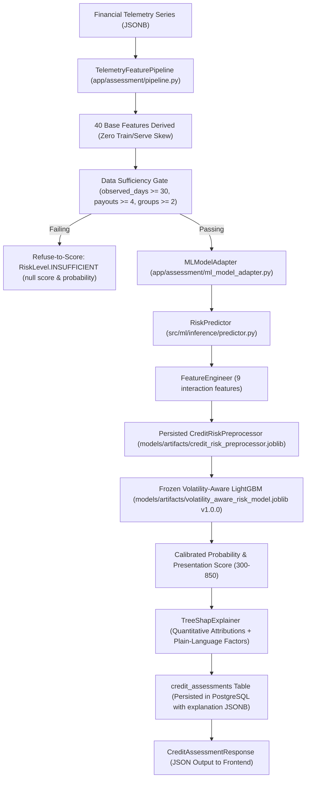

# Phase 13A-5 Execution Report: Remove Stale ML Copy and Synchronize Documentation

**Phase:** 13A-5  
**Title:** Remove Stale ML Copy and Synchronize Documentation  
**Repository:** `Guneshbari/PARAKH`  
**Branch:** `ml/credit-risk`  
**Target Gap:** P1-05 (Phase 12B Gap Analysis)  
**Status:** Complete  

---

## 1. P1-05 Gap Definition

In the frozen **Phase 12B Frontend ↔ Backend ↔ ML Gap Analysis**, gap **P1-05** was identified as follows:
> *"The repository contains stale descriptions, comments, and outdated UI copy across documentation, backend code, and frontend components describing the ML model as 'future', 'upcoming', or dependent on temporary mock engines (`MockAssessmentEngine`), or describing preprocessing as dynamically refitted from synthetic training data rather than loaded from persisted artifacts."*

Following the completion of Phases 13A-1 through 13A-4:
- **Phase 13A-1 (commit `4826ce3`)**: TreeSHAP local feature explanations are persisted in `credit_assessments.explanation` JSONB.
- **Phase 13A-2 (commit `c31a183`)**: Runtime data sufficiency is strictly enforced without fallback default fabrication (`90.0`, `12.0`, `4.0`, `0.0`).
- **Phase 13A-3 (commit `1e41519`)**: Authoritative feature derivation from runtime telemetry (`telemetry_series`) is operational via `TelemetryFeaturePipeline`.
- **Phase 13A-4 (commit `22412e6`)**: Fitted `CreditRiskPreprocessor` is serialized and loaded directly from `models/artifacts/credit_risk_preprocessor.joblib`.

Phase 13A-5 synchronizes all active documentation, system architecture guides, code comments, and frontend UI copy to reflect the frozen, operational credit-risk system while preserving historical audit reports and test-only verification harnesses.

---

## 2. Repository-Wide Audit Scope

The repository audit covered all active and historical surfaces:
1. **Frontend UI Components & Pages**:
   - `frontend/apps/web/app/admin/analytics/page.tsx`
   - `frontend/apps/web/app/admin/dashboard/page.tsx`
   - `frontend/apps/web/app/admin/model-insights/page.tsx`
   - `frontend/apps/web/app/user/applications/new/page.tsx`
   - `frontend/apps/web/app/user/results/[id]/page.tsx`
2. **Backend Application Source & Settings**:
   - `backend/app/core/config.py`
   - `backend/app/assessment/pipeline.py`
   - `backend/app/assessment/ml_engine.py`
   - `backend/app/assessment/ml_model_adapter.py`
   - `backend/app/services/assessment.py`
3. **ML Inference Implementation**:
   - `src/ml/inference/predictor.py`
   - `src/ml/inference/input_validator.py`
   - `src/ml/inference/output_formatter.py`
4. **Active Contracts & Guides**:
   - `docs/inference-contract.md`
   - `docs/backend-ml-integration-contract.md`
   - `backend/docs/ML_BOUNDARY.md`
   - `README.md`
   - `backend/README.md`
   - `src/ml/README.md`
   - `docs/HANDOFF.md`
5. **Historical Reports & Audit Logs**:
   - `docs/PHASE_2_ML_DATA_HANDOFF.md` through `docs/PHASE_13A4_PREPROCESSOR_PERSISTENCE_REPORT.md`
   - `docs/PHASE_12B_FRONTEND_BACKEND_ML_GAP_ANALYSIS_REPORT.md`

---

## 3. Discovered References & Classification

Each discovered reference was audited and classified according to the Phase 13A-5 rules:

| Surface / Reference | Old Content / Description | Classification | Action Taken |
| :--- | :--- | :--- | :--- |
| `frontend/apps/web/app/admin/analytics/page.tsx` (Lines 298, 309, 312) | "Pending ML Pipeline", "ML Analytics Unavailable...", "depend on Person 3's upcoming LightGBM/XGBoost volatility pipeline. In the interim, live assessments are scored through the deterministic MockAssessmentEngine." | **Active UI Copy** | **Updated**: Changed badge to `Cohort Macro Analytics`, heading to `ML Macro Analytics Under Batch Aggregation`, and copy describing real-time scoring via `TelemetryFeaturePipeline` and LightGBM model v1.0.0. |
| `frontend/apps/web/app/admin/dashboard/page.tsx` (Lines 605, 617) | "Pending ML Pipeline", "computed by Person 2 & 3's LightGBM/XGBoost ML pipeline. In the interim, live assessments are scored through the deterministic MockAssessmentEngine..." | **Active UI Copy** | **Updated**: Changed badge to `Cohort Macro Analytics` and copy clarifying that live assessments use the frozen LightGBM model with TreeSHAP explanations. |
| `frontend/apps/web/app/user/applications/new/page.tsx` (Line 272) | `// Step 5: Execute MockAssessmentEngine Evaluation` | **Active UI Comment** | **Updated**: Replaced with `// Step 5: Execute Credit Assessment Evaluation`. |
| `src/ml/inference/predictor.py` (Docstring Lines 21–30) | "No serialised preprocessor artifact exists from Phase 3/6 training runs. At predictor initialisation, this module deterministically re-runs the same split + fit pipeline..." | **Active Code Docstring** | **Updated**: Documented direct loading of `models/artifacts/credit_risk_preprocessor.joblib` and clarified that `reconstruct_fitted_pipeline()` is test-only. |
| `docs/inference-contract.md` (Sections 3, 6, 7, 8, 9) | Stated that `RiskPredictor.__init__()` loads synthetic Parquet dataset to fit `CreditRiskPreprocessor` at startup. | **Active ML Contract** | **Updated**: Replaced with Phase 13A-4 persisted preprocessor artifact loading, documented strict metadata validation, and updated error handling. |
| `docs/backend-ml-integration-contract.md` (Sections 2, 9, 10) | Omitted `TelemetryFeaturePipeline`, described transient explanations, omitted `explanation JSONB` column in DB schema. | **Active System Contract** | **Updated**: Added `TelemetryFeaturePipeline` to architecture flow, documented Phase 13A-2 no-fallback sufficiency, and added `explanation` JSONB persistence. |
| `README.md` (Sections 2, 4, 10, 12) | Described `MockAssessmentEngine` as active default, `ml` as future, and ML models as future integration limitation. | **Active Root Documentation** | **Updated**: Updated architecture diagram to show active ML engine, updated env vars (`ASSESSMENT_ENGINE=ml`), described full ML flow, and updated limitations. |
| `backend/README.md` (Sections 3, 9, 12) | Stated ML scoring algorithms would be introduced in future tasks; described only `MockAssessmentEngine` in scoring section. | **Active Backend Documentation** | **Updated**: Added production `MLAssessmentEngine` / `MLModelAdapter` pipeline description, updated assessment flow diagram, and clarified mock engine testing role. |
| `backend/docs/ML_BOUNDARY.md` (Overview, Section 1, 4) | Described Person 2/3 boundary as future target; table described `explanation` as transient metadata. | **Active Architecture Guide** | **Updated**: Updated architecture diagram, set `ASSESSMENT_ENGINE=ml` as active production default, and updated table to reflect persisted JSONB explanations. |
| `src/ml/README.md` (Sections 1, 5) | Listed model training as future; Section 5 listed model training and data generation as "Intentionally Not Implemented". | **Active ML Documentation** | **Updated**: Updated Section 1 and replaced Section 5 with "Current Frozen System Status (Phases 13A-1 through 13A-4)". |
| `docs/HANDOFF.md` (Header, Section 11) | Stated `MockAssessmentEngine` is active and ML models are designated for future integration. | **Handoff Documentation** | **Updated**: Added prominent status callout documenting completed integration across Phases 2-13A while preserving historical text. |
| `backend/app/assessment/pipeline.py` (Line 121) | `PassthroughFeaturePipeline` docstring stated "Default fallback feature pipeline used prior to ML feature engineering integration." | **Active Code Docstring** | **Updated**: Clarified that it is a legacy/test-only fallback, and that `TelemetryFeaturePipeline` is authoritative in production. |
| `backend/app/assessment/ml_engine.py` (Docstring, Line 162) | Docstrings and exception message referenced "Person 3's trained model". | **Active Code Docstring** | **Updated**: Reframed as PARAKH's trained ML models (LightGBM volatility-aware risk model). |
| `backend/app/services/assessment.py` (Line 10) | Imported unused `PassthroughFeaturePipeline`. | **Dead Import** | **Removed**: Cleaned up unused import. |
| `tests/ml/test_phase9_inference.py` (Line 9) | Comment stated `RiskPredictor` is expensive to initialize (fits preprocessor). | **Test Comment** | **Updated**: Clarified that predictor loads frozen model and persisted preprocessor artifact. |
| `docs/PHASE_10_...` through `docs/PHASE_12B_...` | Historical finding that `PassthroughFeaturePipeline` was passive or defaults were `90.0, 12.0, 4.0`. | **Historical Phase Reports** | **Intentionally Preserved**: Documented truth at time of audit; not modified. |
| `backend/tests/test_ml_boundary.py`, `backend/tests/test_mock_assessment_engine.py` | Unit test suites verifying `MockAssessmentEngine` fallback and boundary isolation. | **Test-Only Verification Logic** | **Intentionally Preserved**: Ensures fallback behavior and engine abstraction remain robust. |

---

## 4. Current ML & Inference Architecture (Post-Phase 13A)

### Key Subsystem Contracts:
1. **Telemetry Feature Derivation**: Reuses authoritative mathematical formulas directly from `src/ml/features/feature_derivation.py`.
2. **Sufficiency Contract**: Missing telemetry is never converted into fabricated sufficient-looking defaults. Missing signals trigger immediate refusal to score.
3. **Preprocessing Contract**: Inference deserializes the exact fitted preprocessor artifact (`credit_risk_preprocessor.joblib`) with strict validation of `is_fitted_`, `model_version == "1.0.0"`, `feature_variant == "VOLATILITY_AWARE"`, and exact 64 output feature alignment.
4. **TreeSHAP Explainability**: Explanations are computed at inference time and permanently stored in PostgreSQL JSONB (`credit_assessments.explanation`), ensuring consistent retrieval across all sessions and page refreshes.

---

## 5. Verification Results

### 5.1 Pytest Test Suites
- **ML Preprocessor Persistence Suite** (`tests/ml/test_phase13a4_preprocessor_persistence.py`): **14 / 14 passed**
- **ML Core Inference Suite** (`tests/ml/test_phase9_inference.py`): **54 / 54 passed**
- **Backend ML Integration Suite** (`backend/tests/test_ml_integration.py`): **10 / 10 passed**
- **Backend ML Boundary Suite** (`backend/tests/test_ml_boundary.py`): **14 / 14 passed**
- **Phase 13A-3 Telemetry Pipeline Suite** (`backend/tests/test_phase13a3_telemetry_pipeline.py`): **27 / 27 passed**
- **Phase 13A-2 Sufficiency Gate Suite** (`backend/tests/test_phase13a2_sufficiency_gate.py`): **13 / 13 passed**
- **Phase 13A-1 TreeSHAP Persistence Suite** (`backend/tests/test_phase13a1_explanation_persistence.py`): **7 passed, 1 skipped**
- **Full Backend Pytest Regression Suite** (`pytest backend/tests/`): **285 passed, 40 skipped, 0 failures**

### 5.2 Frontend Monorepo Verification
- **Typecheck** (`npm --prefix frontend run typecheck`): **0 errors, passed**

---

## 6. Frozen Model & Artifact Hash Audit

All frozen model and preprocessing artifacts were verified via SHA-256:

| Artifact | Expected SHA-256 Checksum | Verified SHA-256 Checksum | Status |
| :--- | :--- | :--- | :--- |
| `models/artifacts/volatility_aware_risk_model.joblib` | `88e8c4d6f75470a600b51e8f76fa442df7e43bb1766a7e759751a786e71c4060` | `88e8c4d6f75470a600b51e8f76fa442df7e43bb1766a7e759751a786e71c4060` | **MATCH / UNMODIFIED** |
| `models/artifacts/FINAL_MODEL.json` | `e8f593bd1714bd93054fa897f343b900bf5c8c39b49d4c839a061b7cd1fb626f` | `e8f593bd1714bd93054fa897f343b900bf5c8c39b49d4c839a061b7cd1fb626f` | **MATCH / UNMODIFIED** |
| `models/artifacts/credit_risk_preprocessor.joblib` | `bba8d91afebb8e88fe1e9e30567b60817c77a28afa055befe1cbf77ed4039eb2` | `bba8d91afebb8e88fe1e9e30567b60817c77a28afa055befe1cbf77ed4039eb2` | **MATCH / UNMODIFIED** |

**Zero Model Retraining Confirmation:**
- No model estimators were trained, retrained, or hyperparameter-tuned.
- No model artifact files were touched or recreated.
- All mathematical evaluation formulas, feature definitions, and scoring thresholds remain 100% frozen.

---

## 7. Remaining Phase 12B Gaps

With Phase 13A-5 complete, all **Priority 1 (P1)** gaps from the Phase 12B Gap Analysis are **CLOSED**:
- **P1-01** (TreeSHAP Explanation Persistence): Closed in Phase 13A-1 (commit `4826ce3`).
- **P1-02** (Sufficiency Fallback Bypass): Closed in Phase 13A-2 (commit `c31a183`).
- **P1-03** (Runtime Telemetry Feature Derivation): Closed in Phase 13A-3 (commit `1e41519`).
- **P1-04** (Preprocessor Artifact Persistence): Closed in Phase 13A-4 (commit `22412e6`).
- **P1-05** (Stale ML Copy & Documentation Synchronization): Closed in Phase 13A-5.

Remaining items are non-blocking **Priority 2 (P2)** and **Priority 3 (P3)** enhancements designated for future product phases:
- **P2-01**: Operational alerts real-time backend pipeline.
- **P2-02**: System audit log admin UI view.
- **P2-03**: Portfolio analytics dynamic date-range query filters.
- **P2-04**: DPDP marketing/notification preference persistence.
- **P2-05**: Applicant profile self-service editing endpoint.
- **P2-06**: Model promotion & rollback admin action APIs.
- **P2-07**: Subgroup fairness metrics runtime pipeline integration.
- **P3-01**: Cleanup of unused placeholder API endpoints.
- **P3-02**: Global SHAP feature importance dashboard.
- **P3-03**: Historical assessment comparison drawer.
