# Phase 14D — Persist DPDP Consent Preferences (P2-04)

**Gap Closed:** P2-04 from the frozen Phase 12B Frontend ↔ Backend ↔ ML Gap Analysis Report  
**Branch:** `ml/credit-risk`  
**Commit:** `feat: persist dpdp consent preferences`  
**Previous Phase:** 14C (`d08b513` — Add Analytics Date Range Filters)

---

## 1. P2-04 Gap Definition

> **P2-04** — Wire DPDP Consent Preferences  
> *"Persist profile privacy toggles to the database."*  
> *"On `/user/profile`, toggles for Anonymized Industry Volatility Benchmarking, Real-Time Telemetry Ingestion, and Automated Downside Shock Alerts have no corresponding backend endpoints or database columns."*  
> *"Clicking any of the 3 privacy preference switches on `/user/profile` toggles React state only; no network request is sent."*  
> — *Phase 12B Gap Analysis Report (lines 297, 316, 539, 575)*

In Phase 12B, the audit revealed that the user profile page (`/user/profile`) contained a UI section entitled *"Privacy Safeguards & DPDP Consent Preferences"* with three toggle switches:
1. **Anonymized Industry Volatility Benchmarking** (`consentBenchmark`)
2. **Continuous Telemetry Refresh / Real-Time Telemetry Ingestion** (`consentRealtime`)
3. **Volatile Shock Rebound Alerts / Automated Downside Shock Alerts** (`consentAlerts`)

Prior to Phase 14D, these toggles were bound exclusively to transient React component state (`useState(true)`). They defaulted to `true` on page load regardless of applicant consent, sent zero network requests when toggled, and had no underlying PostgreSQL persistence or backend API endpoints.

---

## 2. Architecture & Separation of Concerns

Under the Digital Personal Data Protection (DPDP) Act 2023 principles and the PARAKH security model, user consent falls into two strictly separated tiers:

```mermaid
flowchart TD
    subgraph Tier1["Tier 1: Mandatory Assessment Data-Source Consent"]
        C1["consents table"] --> C2["data_source: PLATFORM | FINANCIAL_ACTIVITY | UTILITY"]
        C2 --> C3["application_id scoped"]
        C3 --> C4["AssessmentService & FinancialSignalService Enforcement"]
        C4 -->|Missing or Revoked| C5["HTTP 403 Forbidden / ConsentRequiredError"]
    end

    subgraph Tier2["Tier 2: Auxiliary DPDP Privacy Preferences (P2-04)"]
        P1["applicant_consent_preferences table"] --> P2["user_id & preference_key scoped"]
        P2 --> P3["consent_benchmark | consent_realtime | consent_alerts"]
        P3 --> P4["Self-service control on /user/profile"]
        P4 --> P5["Audit Logged: CONSENT_GRANTED / CONSENT_REVOKED"]
    end
```



### Strict Architectural Boundaries
- **Assessment Consent Integrity:** Tier 1 data-source consent is strictly required for evaluating alternative credit risk on a specific application. It remains completely independent and untouched. Profile DPDP privacy toggles **cannot** bypass, satisfy, or substitute for mandatory application assessment consent. Missing or revoked assessment consent continues to trigger HTTP 403 `ConsentRequiredError`.
- **Default Non-Granting:** Under DPDP statutory requirements, missing or uninitialized preferences **never default to granted**. All uninitialized preferences evaluate strictly to `false` in database queries and API responses.
- **Auditable & Persistent:** Every grant and revocation updates PostgreSQL timestamps (`consented_at`, `revoked_at`, `updated_at`) and generates immutable entries in `audit_logs`.

---

## 3. Database Schema & Migration

### 3.1 Table Definition: `applicant_consent_preferences`

Implemented via SQLAlchemy model `ConsentPreference` in [`backend/app/models/consent.py`](file:///home/gnx/Projects/PARAKH/backend/app/models/consent.py) and registered in `User.consent_preferences`:

| Column | Type | Constraints | Description |
|---|---|---|---|
| `id` | `UUID` | Primary Key, default `uuid.uuid4` | Unique preference record identifier |
| `user_id` | `UUID` | Foreign Key `users.id` (CASCADE), Indexed, Not Null | Authenticated user owning this preference |
| `applicant_profile_id` | `UUID` | Foreign Key `applicant_profiles.id` (CASCADE), Indexed, Nullable | Associated gig worker profile (if created) |
| `preference_key` | `VARCHAR(100)` | Indexed, Not Null | Canonical preference key identifier |
| `granted` | `BOOLEAN` | Server default `false`, Not Null | Current explicit consent status |
| `consented_at` | `TIMESTAMPTZ` | Nullable | UTC timestamp when consent was explicitly granted |
| `revoked_at` | `TIMESTAMPTZ` | Nullable | UTC timestamp when consent was explicitly revoked |
| `created_at` | `TIMESTAMPTZ` | Server default `now()`, Not Null | Record initial creation timestamp |
| `updated_at` | `TIMESTAMPTZ` | Server default `now()`, Not Null | Record last modification timestamp |

**Unique Constraint:**
- `uq_user_preference_key`: `UNIQUE (user_id, preference_key)` ensures exactly one authoritative persistent record per user per preference category.

### 3.2 Canonical Preference Keys & Normalization

The repository and service layers recognize three canonical keys and normalize all known aliases:

| Canonical Key | Description | Supported Aliases |
|---|---|---|
| `consent_benchmark` | Anonymized Industry Volatility Benchmarking | `consentBenchmark`, `anonymized_benchmarking`, `anonymized_industry_volatility_benchmarking` |
| `consent_realtime` | Continuous Telemetry Refresh / Real-Time Telemetry Ingestion | `consentRealtime`, `realtime_telemetry`, `continuous_telemetry_refresh` |
| `consent_alerts` | Volatile Shock Rebound Alerts / Automated Downside Shock Alerts | `consentAlerts`, `shock_alerts`, `volatile_shock_rebound_alerts` |

### 3.3 Alembic Migration

Created revision [`e0f1a2b3c4d5_add_applicant_consent_preferences_table.py`](file:///home/gnx/Projects/PARAKH/backend/alembic/versions/e0f1a2b3c4d5_add_applicant_consent_preferences_table.py) revising `d9e2f3a4b5c6`:
- Applies clean `CREATE TABLE applicant_consent_preferences` with non-null `server_default=sa.text("false")`.
- Applied successfully to live PostgreSQL container `parakh-postgres` via `alembic upgrade head`.

---

## 4. API Endpoints & RBAC Security

Added to [`backend/app/api/v1/consents.py`](file:///home/gnx/Projects/PARAKH/backend/app/api/v1/consents.py):

### 4.1 `GET /api/v1/consents/preferences`
- **Authentication:** Mandatory (`Bearer` token via `get_current_active_user`). Unauthenticated requests fail with **HTTP 401**.
- **Role Permissions:**
  - `APPLICANT`: Can read only their own preferences. Querying another user's ID returns **HTTP 403 Forbidden**.
  - `REVIEWER` / `ADMIN`: Can read their own or query an applicant's preferences via optional `?user_id=` parameter.
- **Default Semantics:** If no records exist in PostgreSQL, returns `consent_benchmark: false`, `consent_realtime: false`, `consent_alerts: false` with null timestamps.

### 4.2 `PATCH /api/v1/consents/preferences` & `PUT /api/v1/consents/preferences`
- **Authentication:** Mandatory.
- **Role Permissions:**
  - `APPLICANT`: Can modify only their own preferences. Attempting to update another user's ID returns **HTTP 403 Forbidden**.
  - `ADMIN`: Can update preferences on behalf of users.
  - `REVIEWER`: Modification strictly prohibited (**HTTP 403 Forbidden**).
- **Payload:** Accepts canonical snake_case or camelCase keys (`consent_benchmark`, `consentBenchmark`, etc.).
- **Audit Integration:** Emits `AuditAction.CONSENT_GRANTED` or `AuditAction.CONSENT_REVOKED` for each modified preference.

### 4.3 `POST /api/v1/consents/preferences/{preference_key}/revoke`
- **Authentication:** Mandatory.
- **Semantics:** Explicit single-preference revocation endpoint. Sets `granted = false`, stamps `revoked_at = utcnow()`, emits `AuditAction.CONSENT_REVOKED`, and returns the updated preference state.

---

## 5. Frontend Client & UI Implementation

### 5.1 Frontend API Client (`@parakh/api`)
Added in [`frontend/packages/api/index.ts`](file:///home/gnx/Projects/PARAKH/frontend/packages/api/index.ts) and [`frontend/packages/api/types.ts`](file:///home/gnx/Projects/PARAKH/frontend/packages/api/types.ts):
- `BackendConsentPreferences`, `BackendConsentPreferencesUpdate`, and `BackendConsentPreferenceItem` TypeScript interfaces.
- `api.getConsentPreferences(userId?: string): Promise<BackendConsentPreferences>`
- `api.updateConsentPreferences(preferences: BackendConsentPreferencesUpdate, userId?: string): Promise<BackendConsentPreferences>`
- `api.revokeConsentPreference(preferenceKey: string, userId?: string): Promise<BackendConsentPreferences>`

### 5.2 User Profile Page (`/user/profile`)
Updated [`frontend/apps/web/app/user/profile/page.tsx`](file:///home/gnx/Projects/PARAKH/frontend/apps/web/app/user/profile/page.tsx):
- **Safe Initial State:** Replaced hardcoded `useState(true)` with `useState(false)`.
- **Backend Hydration:** `fetchProfileData` calls `api.getConsentPreferences()` on mount and syncs PostgreSQL state to UI toggles.
- **Immediate Persistence on Toggle:** When the applicant clicks any toggle, `handleTogglePreference` sends a `PATCH /api/v1/consents/preferences` request.
- **Visual Feedback:**
  - Top-level *"Syncing preferences..."* indicator with spinning icon during initial fetch.
  - Per-toggle *"Saving..."* indicator with disabled checkbox during mutation.
  - Green success banner (`data-testid="consent-preference-success"`): *"Anonymized Volatility Benchmarking granted and persisted to database."*
  - Error banner (`data-testid="consent-preference-error"`) with automatic state rollback if the backend network request fails.

---

## 6. Verification & Test Evidence

### 6.1 Backend Deterministic Test Suite (`test_phase14d_consent_preferences.py`)
13 focused test cases executed via `.venv-ml/bin/pytest`:
1. `test_default_preferences_are_false`: Unset preferences return `false`; missing consent is never defaulted to granted.
2. `test_applicant_patch_preferences`: Applicant can update preferences and persisted state reflects new values with `consented_at`.
3. `test_applicant_put_preferences`: PUT endpoint properly upserts and persists preferences.
4. `test_revoke_preference_via_endpoint`: Dedicated revocation endpoint sets `granted=false` and stamps `revoked_at`.
5. `test_preference_key_alias_normalization`: CamelCase (`consentBenchmark`) and snake_case aliases correctly normalize to canonical keys.
6. `test_applicant_cannot_access_other_applicant_preferences`: Ownership enforced; viewing another applicant's preferences returns HTTP 403.
7. `test_applicant_cannot_modify_other_applicant_preferences`: Ownership enforced; updating another applicant's preferences returns HTTP 403.
8. `test_applicant_cannot_revoke_other_applicant_preferences`: Ownership enforced; revoking another applicant's preferences returns HTTP 403.
9. `test_unauthenticated_request_rejected`: Unauthenticated GET/PATCH calls rejected with HTTP 401.
10. `test_reviewer_can_read_but_cannot_modify_applicant_preferences`: Reviewers can read applicant preferences (HTTP 200) but cannot mutate them (HTTP 403).
11. `test_admin_can_read_and_modify_preferences`: Admin can view and mutate preferences on behalf of users.
12. `test_audit_logging_on_preference_changes`: Verifies `AuditLog` records created for `CONSENT_GRANTED` and `CONSENT_REVOKED` with `entity_type == "ConsentPreference"`.
13. `test_assessment_consent_enforcement_remains_intact`: Confirms DPDP profile toggles **never** bypass application data-source consent checks; `AssessmentService.assess_application` strictly raises `ConsentRequiredError` (HTTP 403) when application consent is missing or revoked.

**Result:** `13 passed in 21.97s`

### 6.2 Frontend Contract Test Suite (`test-phase14d-consent-preferences.ts`)
Executed in `parakh-frontend` container:
- Method exposure on `ApiClient` verified.
- Request URL, query params, HTTP verbs, and payload JSON serialization verified.
- HTTP 403 ownership error handling and HTTP 401 unauthenticated handling verified.

**Result:** `ALL PHASE 14D FRONTEND TESTS PASSED! ✓`

### 6.3 Live End-to-End Database Integration
Tested via `curl` against running `parakh-backend` and PostgreSQL:
- Created user `applicant.live.phase14d@parakh.io` via live API.
- Authenticated via `POST /api/v1/auth/login`.
- `GET /api/v1/consents/preferences`: Returned `false` for all 3 flags.
- `PATCH /api/v1/consents/preferences`: Granted benchmark & realtime. Returned `consented_at: "2026-09-26T19:16:52.099007Z"`.
- `POST /api/v1/consents/preferences/consent_benchmark/revoke`: Revoked benchmark. Returned `revoked_at: "2026-09-26T19:16:59.626285Z"`.
- Ownership check: Separate applicant token querying first applicant returned **HTTP 403**.
- Audit inspection: PostgreSQL `audit_logs` confirmed `CONSENT_GRANTED`, `CONSENT_GRANTED`, `CONSENT_REVOKED` records.

### 6.4 Regression Suite
Executed full multi-phase regression suite:
```
backend/tests/test_phase14d_consent_preferences.py .............         [ 18%]
backend/tests/test_phase14c_analytics_date_filters.py ..........         [ 32%]
backend/tests/test_phase14b_audit_viewer.py ..........                   [ 47%]
backend/tests/test_operational_alerts.py .................               [ 71%]
backend/tests/test_consent_privacy.py .............s                     [ 91%]
backend/tests/test_migrations.py ......                                  [100%]
================== 69 passed, 1 skipped, 2 warnings in 55.70s ==================
```

---

## 7. Frozen ML Artifact Integrity

Pre-phase and post-phase SHA-256 hashes of all frozen artifacts were verified:

| Artifact Path | SHA-256 Hash | Status |
|---|---|---|
| `models/artifacts/volatility_aware_risk_model.joblib` | `88e8c4d6f75470a600b51e8f76fa442df7e43bb1766a7e759751a786e71c4060` | Identical |
| `models/artifacts/FINAL_MODEL.json` | `e8f593bd1714bd93054fa897f343b900bf5c8c39b49d4c839a061b7cd1fb626f` | Identical |
| `models/artifacts/credit_risk_preprocessor.joblib` | `bba8d91afebb8e88fe1e9e30567b60817c77a28afa055befe1cbf77ed4039eb2` | Identical |

Zero modifications to ML scoring formulas, preprocessing artifacts, feature pipelines, or risk calibration thresholds.

---

## 8. Remaining P2 / P3 Gap Inventory

With **P2-04** resolved, the remaining gaps from Phase 12B are:
- **P2-05:** Wire Applicant Profile Editing (`PATCH /api/v1/applicants/{id}`)
- **P2-06:** Model Promotion / Activation API (`POST /api/v1/model-versions/{id}/activate`)
- **P2-07:** Wire Offline Fairness Evaluation Execution (`GroupedFairnessAuditor`)
- **P2-08:** Clean Up Unused & Redundant API Client Methods in `@parakh/api`
- **P2-09:** Clean Up Unconsumed Application Backend Routes
- **P3-01:** Reconcile UI Metric Names & Review Form Copy with Production ML Terminology
- **P3-02:** Global SHAP Feature Importance Dashboard View
- **P3-03:** Render "Unrated" Instead of 0 for Empty Portfolio
