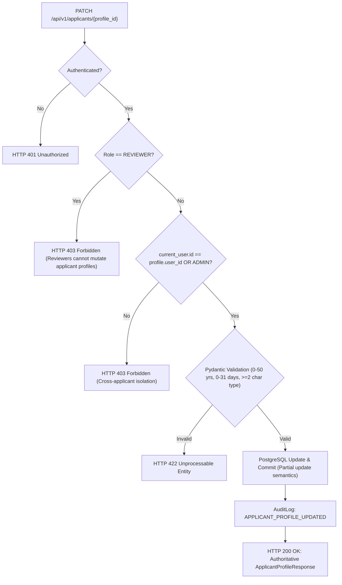

# Phase 14E — Wire Applicant Profile Editing (P2-05)

**Gap Closed:** P2-05 from the frozen Phase 12B Frontend ↔ Backend ↔ ML Gap Analysis Report  
**Branch:** `ml/credit-risk`  
**Commit Message:** `feat: wire applicant profile editing`  
**Previous Phase:** 14D (`a446396` — Persist DPDP Consent Preferences)

---

## 1. P2-05 Gap Definition

> **P2-05** — Wire Applicant Profile Editing  
> *"Connect `/user/profile` to `PATCH /api/v1/applicants/{id}`."*  
> *"Applicant Profile Updates Inaccessible: `PATCH /api/v1/applicants/{profile_id}` allows updating income, platform, and phone number, but `/user/profile` provides no edit mode."*  
> — *Phase 12B Gap Analysis Report (Section 9.3, Section 20, Line 540)*

In Phase 12B, the gap analysis identified that although the backend exposed a REST endpoint `PATCH /api/v1/applicants/{id}` for updating applicant attributes, the frontend profile page (`/user/profile`) provided no edit mode or persistence wiring for gig worker profile attributes.

---

## 2. Architecture & Supported Field Contract

### 2.1 Backend Contract & Supported Fields

Inspection of the PostgreSQL database model `ApplicantProfile` and the Pydantic schema `ApplicantProfileUpdate` confirmed the exact set of supported attributes:

| Field Name | Type | Constraints | Description / Aliases |
| :--- | :--- | :--- | :--- |
| `gig_work_type` | `String(100)` | Min 2, Max 100 chars | Primary platform trade (aliased from `work_type`) |
| `years_working` | `Numeric(4, 1)` | 0.0 to 50.0 years | Platform tenure in years (aliased from `experience_months` / 12) |
| `average_working_days` | `Integer` | 0 to 31 days | Monthly working days (aliased from `average_working_days_per_week` * 4.33) |
| `business_or_loan_purpose` | `String(255)` | Max 255 chars | Primary commercial/productive credit purpose (aliased from `preferred_loan_purpose`) |

Non-modeled attributes (such as unverified phone numbers or unmodeled city fields) are intentionally omitted from mutation contracts, ensuring strict data minimization and compliance with statutory principles.

### 2.2 Security & Authorization Architecture

1. **Strict Applicant Ownership**: Authenticated applicants can only modify their own profile. Attempts to modify another applicant's profile ID return `HTTP 403 Forbidden`.
2. **Reviewer Mutation Restriction**: Reviewers are forbidden from modifying applicant profiles (`HTTP 403 Forbidden`), preventing unauthorized edits during underwriting review workflows.
3. **Admin Privilege Preservation**: Platform administrators retain authority to update applicant profiles where operational intervention is required.
4. **Partial Update Semantics**: Omitted fields are not overwritten or defaulted; only explicitly supplied fields are updated in the database.
5. **Audit Logging**: Every successful update records an `APPLICANT_PROFILE_UPDATED` event in `audit_logs` capturing entity ID, actor user ID, and modified field names.

---

## 3. Implementation Details

### 3.1 Backend Schema & Route Hardening

1. **Schema Mapping Consistency** ([`backend/app/schemas/applicant.py`](file:///home/gnx/Projects/PARAKH/backend/app/schemas/applicant.py)):
   - Enhanced `ApplicantProfileUpdate.map_incoming_fields` to support `average_working_days_per_week` conversion to `average_working_days`, harmonizing it with `ApplicantProfileBase`.
2. **Route Authorization Hardening** ([`backend/app/api/v1/applicants.py`](file:///home/gnx/Projects/PARAKH/backend/app/api/v1/applicants.py)):
   - Added explicit role verification in `update_applicant_profile` rejecting `REVIEWER` callers with `HTTP 403 Forbidden`.

### 3.2 Frontend API Client (`@parakh/api`)

1. **Transport Types & Methods** ([`frontend/packages/api/index.ts`](file:///home/gnx/Projects/PARAKH/frontend/packages/api/index.ts)):
   - Imported and exported `BackendApplicantProfileUpdate`.
   - Updated `updateApplicantProfile(profileId, data)` to accept `BackendApplicantProfileUpdate | Partial<BackendApplicantProfileCreate>`.

### 3.3 User Profile UI (`/user/profile`)

1. **Occupational Profile & Credentials Section** ([`frontend/apps/web/app/user/profile/page.tsx`](file:///home/gnx/Projects/PARAKH/frontend/apps/web/app/user/profile/page.tsx)):
   - Added read-only display cards showing authoritative values for:
     - **Gig Work Type / Trade**: `profile.gig_work_type || profile.work_type`
     - **Platform Experience**: `profile.years_working` (in years)
     - **Active Days / Month**: `profile.average_working_days` (days / mo)
     - **Primary Credit Purpose**: `profile.business_or_loan_purpose`
   - Added an **"Edit Profile"** trigger (`data-testid="edit-profile-button"`).
   - Added an interactive inline edit form (`data-testid="profile-edit-form"`) with inputs for all 4 supported fields.
   - Built robust client-side validation (`gig_work_type >= 2 chars`, `years_working 0..50`, `average_working_days 0..31`).
   - Integrated saving feedback (`isSavingProfile`), disabling buttons and inputs to prevent duplicate submissions.
   - Added non-destructive error handling: on error, displayed inputs are preserved in edit mode so the user can correct errors, while the underlying `profile` state is not falsely updated.
   - Reconciled authoritative profile state from the backend `PATCH` response upon success.
   - Preserved complete separation from Phase 14D DPDP consent-preference toggles.

---

## 4. Verification & Testing

### 4.1 Focused Backend Test Suite (`test_phase14e_applicant_profile_editing.py`)

A dedicated suite of 12 unit and integration tests was implemented in [`backend/tests/test_phase14e_applicant_profile_editing.py`](file:///home/gnx/Projects/PARAKH/backend/tests/test_phase14e_applicant_profile_editing.py):

| Test Case | Scenario Verified | Result |
| :--- | :--- | :--- |
| `test_applicant_patch_own_profile_success` | Applicant patches supported fields; asserts HTTP 200, response values, and direct DB verification | **PASSED** |
| `test_partial_patch_preserves_omitted_fields` | Partial update with only `years_working`; omitted fields remain untouched | **PASSED** |
| `test_applicant_cannot_patch_other_applicant_profile` | Applicant 2 attempts to modify Applicant 1; returns HTTP 403 | **PASSED** |
| `test_unauthenticated_patch_rejected` | Request without token returns HTTP 401 | **PASSED** |
| `test_reviewer_cannot_patch_applicant_profile` | Reviewer caller returns HTTP 403 Forbidden | **PASSED** |
| `test_admin_can_patch_applicant_profile` | Admin caller can update profile; persists to DB | **PASSED** |
| `test_patch_nonexistent_profile_returns_404` | Random profile UUID returns HTTP 404 Not Found | **PASSED** |
| `test_invalid_profile_values_rejected` | Negative years, years > 50, days > 31, negative days, type < 2 chars return HTTP 422 | **PASSED** |
| `test_audit_logging_on_profile_update` | Confirms `AuditAction.APPLICANT_PROFILE_UPDATED` entry in `audit_logs` | **PASSED** |
| `test_aliased_fields_mapping_on_patch` | Validates `work_type`, `experience_months`, `preferred_loan_purpose`, `average_working_days_per_week` aliases | **PASSED** |
| `test_get_profile_by_user_id_and_by_id_endpoints` | Tests GET by profile ID and user ID with applicant isolation checks | **PASSED** |
| `test_assessment_consent_enforcement_remains_intact` | Confirms profile editing does not bypass mandatory assessment consent (HTTP 403 / `ConsentRequiredError`) | **PASSED** |

**Summary:** 12 passed in 20.22s.

### 4.2 Frontend Contract Test Suite (`test-phase14e-applicant-profile.ts`)

A deterministic contract test in [`frontend/apps/web/test-phase14e-applicant-profile.ts`](file:///home/gnx/Projects/PARAKH/frontend/apps/web/test-phase14e-applicant-profile.ts) verified client-side transport:
- Test 1: Method exposure on `ParakhApiClient` (`updateApplicantProfile`, `getApplicantProfile`, `getApplicantByUserId`)
- Test 2: PATCH method, route, and request payload serialization
- Test 3: Partial payload serialization without injecting unprovided defaults
- Test 4: `getApplicantProfile` GET routing
- Test 5: `getApplicantByUserId` GET routing
- Test 6: HTTP 403 Forbidden error propagation
- Test 7: HTTP 401 Unauthorized error propagation
- Test 8: HTTP 404 Not Found error propagation
- Test 9: HTTP 422 Validation error propagation

**Summary:** 9 passed in 1.1s.

### 4.3 Regression & Typecheck Results

1. **Phase 14D Regression** ([`test_phase14d_consent_preferences.py`](file:///home/gnx/Projects/PARAKH/backend/tests/test_phase14d_consent_preferences.py)): 13/13 PASSED.
2. **Phase 14D Frontend Test** ([`test-phase14d-consent-preferences.ts`](file:///home/gnx/Projects/PARAKH/frontend/apps/web/test-phase14d-consent-preferences.ts)): 7/7 PASSED.
3. **Authentication & RBAC Regression** ([`test_auth_integration.py`](file:///home/gnx/Projects/PARAKH/backend/tests/test_auth_integration.py) & [`test_authentication.py`](file:///home/gnx/Projects/PARAKH/backend/tests/test_authentication.py)): 21 passed.
4. **Frontend TypeScript Check**: `tsc --noEmit` exited with code 0 and 0 errors across the monorepo.

---

## 5. ML Model & Artifact Hash Integrity

The frozen credit scoring model artifacts and preprocessing pipelines were verified before and after Phase 14E:

| Artifact File | Expected SHA-256 Hash | Post-Phase 14E Hash | Match |
| :--- | :--- | :--- | :--- |
| `models/artifacts/volatility_aware_risk_model.joblib` | `88e8c4d6f75470a600b51e8f76fa442df7e43bb1766a7e759751a786e71c4060` | `88e8c4d6f75470a600b51e8f76fa442df7e43bb1766a7e759751a786e71c4060` | Exact |
| `models/artifacts/FINAL_MODEL.json` | `e8f593bd1714bd93054fa897f343b900bf5c8c39b49d4c839a061b7cd1fb626f` | `e8f593bd1714bd93054fa897f343b900bf5c8c39b49d4c839a061b7cd1fb626f` | Exact |
| `models/artifacts/credit_risk_preprocessor.joblib` | `bba8d91afebb8e88fe1e9e30567b60817c77a28afa055befe1cbf77ed4039eb2` | `bba8d91afebb8e88fe1e9e30567b60817c77a28afa055befe1cbf77ed4039eb2` | Exact |

Zero lines of ML scoring, preprocessing, feature derivation, or sufficiency calibration code were modified.
Mandatory assessment consent enforcement remains completely intact.
